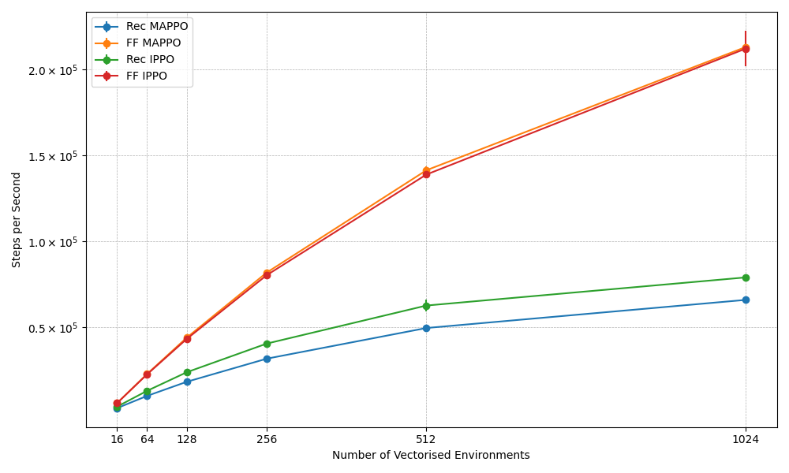

<p align="center">
    <a href="docs/images/mava_logos/mava_full_logo.png">
        
    </a>
</p>

<h2 align="center">
    <p>Distributed Multi-Agent Reinforcement Learning in JAX</p>
</h2>

<div align="center">
<!-- <a  href="https://pypi.org/project/id-mava/">
    
</a>
<a  href="https://pypi.org/project/id-mava/">
    
</a> -->
<!-- <a  href="https://github.com/instadeepai/Mava/actions/workflows/ci.yaml?query=branch%3Adevelop">
    
</a> -->
<a  href="https://github.com/instadeepai/Mava/blob/main/LICENSE">
    
</a>
<a  href="https://github.com/psf/black">
    
</a>
</div>

<hr>

👋 **UPDATE - 24/8/2023**: This is out first release of an end-to-end JAX version of Mava. Henceforth we will only be supporting JAX-based environments and systems with native support for the [Jumanji][jumanji] environment API. The reason for this change is to have a lightweight and easy-to-use end-to-end JAX based research tool. We are currently following a similar design philosophy to [CleanRL][cleanrl] and [PureJaxRL][purejaxrl] where we allow for code duplication to enable readability. All algorithmic logic can be found in the file implementing a particular algorithm. If you would still like to use our deprecated TF2-based framework and systems please install [`v0.1.3`](https://github.com/instadeepai/Mava/releases/tag/0.1.3) of Mava (e.g. `pip install id-mava==0.1.3`).

<hr>

## Welcome to Mava! 🦁

<div align="center">

[**Installation**](#installation-) | [**Quickstart**](#quickstart-)

</div>

Mava provides simplified code for quickly iterating on ideas in multi-agent reinforcement learning (MARL). Mava provides useful implementations of MARL algorithms in JAX allowing for easy parallelisation across devices with JAX's `pmap`. Originating in the Research Team at [InstaDeep](https://www.instadeep.com/). “Mava” means experience, or wisdom, in Xhosa - one of South Africa’s eleven official languages.

To join us in these efforts, please feel free to reach out, raise issues or read our [contribution guidelines](#contributing-) (or just star 🌟 to stay up to date with the latest developments)!

## Performance and Speed 🚀

It should be noted that in all cases Mava is trained using a NVIDIA Quadro RTX 4000 with 8GB Memory.

In order to show the utility of end-to-end JAX-based MARL systems and JAX-based environments we compare the _speed_ in total training wallclock time of Mava against [EPyMARL][epymarl] on simple [Robotic Warehouse][rware] (RWARE) tasks with 2 and 4 agents. **It should be noted in this case that we are not trying to achieve optimal performance on EPyMARL** but using the framework as a means to illustrate the speed increases that are possible with using end-to-end Jax-based systems. In both cases, systems have been trained up to 20 million total environment steps with 16 vectorised environments.

<p align="center">
    <a href="docs/images/rware_results/ff_mappo_tiny2ag.png">
        
    </a>
    <a href="docs/images/rware_results/ff_mappo_tiny4ag.png">
        
    </a>
    <a href="docs/images/rware_results/ff_mappo_small4ag.png">
        
    </a>
    <br>
    <div style="text-align:center; margin-top: 10px;"> Mava MAPPO performance on the tiny-2ag, tiny-4ag and small-4ag RWARE tasks.</div>
</p>

### 📌 An important note on converged performance differences

In order to benefit from the wallclock speed-ups afforded by JAX-based systems it is required that environments be stateless. It is for this reason that Mava does not use the exact same version of the RWARE environment as the EPyMARL systems were trained on but instead uses a JAX-based implementation of RWARE found in [Jumanji][jumanji_rware]. One of the noteable difference in the underlying environment logic is that the RWARE version in Jumanji will not attempt to handle agent collisions in the environment but will instead terminate an episode upon agent collision. In our experiments, this appeared to make the environment more challenging. For a more detailed discussion, please see the following [page](docs/detailed_comparison.md).

### 🧨 Vectorised environments

Furthermore, we illustrate the speed of JAX-based MARL by illustrating the system steps per second as the number of parallel environments are increased. These steps per secondscaling plots were computed using a RTX-3060 Mobile GPU with 6GB memory.

<p align="center">
    <a href="docs/images/mava_sps_results.png">
        
    </a>
    <br>
    <div style="text-align:center; margin-top: 10px;"> Mava environment steps per second scaling with increased vectorised environments.</div>
</p>

Here, also note the system performance on a larger set of Robotic Warehouse environments. In all cases systems were trained up to 200 million environment timesteps with 512 vectorised environments. We give the average experiment wall clock time on the x-axis.


## Code Philosophy

The current code in Mava is adapted from [PureJaxRL](purejaxrl) which provides high-quality single-file implementations with research-friendly features. In turn, PureJaxRL is inspired by the code philosophy from [CleanRL][cleanrl]. Along this vein of easy to use and understand RL codebases, Mava is not designed to be a modular library and is not meant to be imported. Our repository focuses on simplicity and clarity in its implementations, while utilising the advantages offered by JAX such as `pmap` and `vmap`, making it an excellent resource for researchers and practitioners to build upon.

## Overview 🦜

Mava currently offers the following building blocks for MARL research:

- 🥑 **Implementations of MARL algorithms**: Implementations of multi-agent PPO systems that follow both the Centralised Training with Decentralised Execution (CTDE) and Decentralised Training with Decentralised Execution (DTDE) MARL paradigms.
- 🍬 **Environment Wrappers**: Example wrapper for mapping a Jumanji environment to an environment usable by Mava. At the moment we only support [Robotic Warehouse][jumanji_rware] but plan to support more environments soon.
- 🎓 **Educational Material**: [Quickstart notebook][quickstart] to demonstrate how Mava can be used and to highlight the added value of JAX-based MARL.

## Installation 🎬

At the moment Mava is not meant to be installed as a library, but rather to be used as a research tool.

You can use Mava by cloning the repo and pip installing as follows:

```bash
git clone https://github.com/instadeepai/mava.git
cd mava
pip install -e .
```

We have tested `Mava` on Python 3.9. Note that because the installation of JAX differs depending on your hardware accelerator,
we advise users to explicitly install the correct JAX version (see the [official installation guide](https://github.com/google/jax#installation)). For more in-depth instalations guides including Docker builds and virtual environments, please see our [detailed installation guide](DETAILED_INSTALL.md).

## Quickstart ⚡

We have a [Quickstart notebook][quickstart] that can be used to quickly create and train your first Multi-Agent System.

## Contributing 🤝

Please read our [contributing docs](./CONTRIBUTING.md) for details on how to submit pull requests, our Contributor License Agreement and community guidelines.

## Roadmap 🛤️

We plan to iteratively expand Mava in the following increments:

- 🌴 Support for more multi-agent Jumanji environments.
- 📊 Benchmarks on a more environments.
- 🦾 Support for off-policy algorithms.

Please do follow along as we develop this next phase!

## Citing Mava 📚

If you use Mava in your work, please cite the accompanying
[technical report][Paper] (to be updated soon to reflect our transition to JAX):

```bibtex
@article{pretorius2021mava,
    title={Mava: A Research Framework for Distributed Multi-Agent Reinforcement Learning},
    author={Arnu Pretorius and Kale-ab Tessera and Andries P. Smit and Kevin Eloff
    and Claude Formanek and St John Grimbly and Siphelele Danisa and Lawrence Francis
    and Jonathan Shock and Herman Kamper and Willie Brink and Herman Engelbrecht
    and Alexandre Laterre and Karim Beguir},
    year={2021},
    journal={arXiv preprint arXiv:2107.01460},
    url={https://arxiv.org/pdf/2107.01460.pdf},
}
```

## See Also 🔎

The current version of Mava has been based on code from the following projects:

- 🤖 [PureJaxRL][purejaxrl] provides simple code implementations for end-to-end RL training in JAX.
- 🌀 [DeepMind Anakin][anakin_notebook] provides a notebook that illustrates using the Anakin podracer architecture for training RL systems in JAX at scale.
- 🌳 [EPyMARL][epymarl] provides a framework for training MARL systems using a PyTorch backend.

[Paper]: https://arxiv.org/pdf/2107.01460.pdf
[quickstart]: https://github.com/instadeepai/Mava/blob/develop/quickstart.ipynb
[jumanji]: https://github.com/instadeepai/jumanji
[cleanrl]: https://github.com/vwxyzjn/cleanrl
[purejaxrl]: https://github.com/luchris429/purejaxrl
[jumanji_rware]: https://instadeepai.github.io/jumanji/environments/robot_warehouse/
[epymarl]: https://github.com/uoe-agents/epymarl
[anakin_notebook]: https://colab.research.google.com/drive/1974D-qP17fd5mLxy6QZv-ic4yxlPJp-G?usp=sharing
[rware]: https://github.com/semitable/robotic-warehouse
