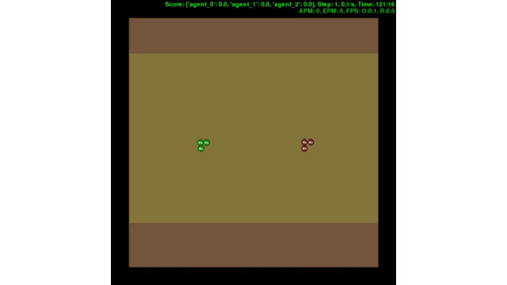
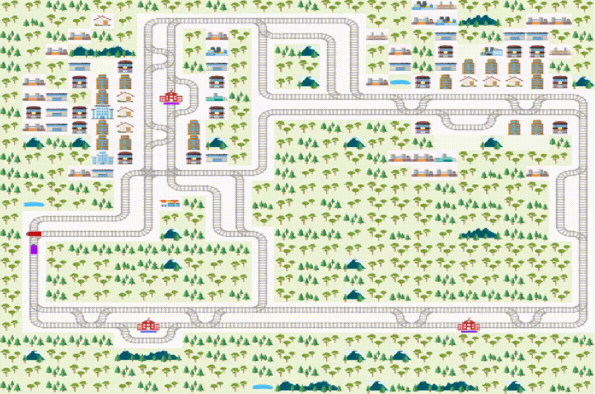
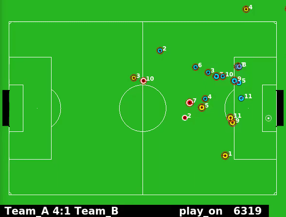
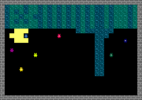
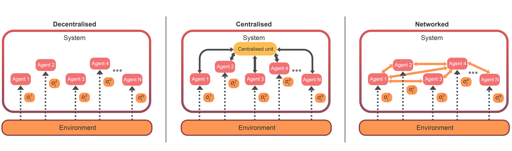
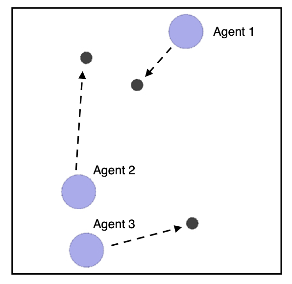
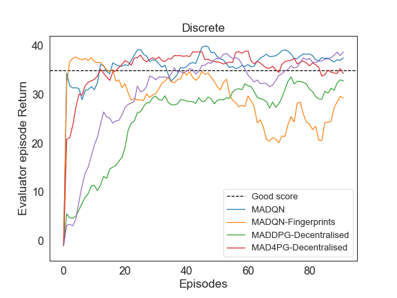
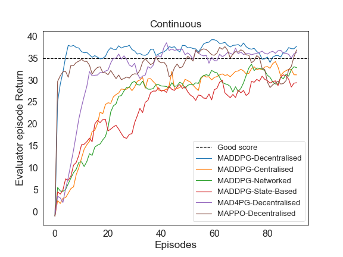

# Mava: a research framework for distributed multi-agent reinforcement learning


[](https://pypi.org/project/id-mava/)

[](https://lgtm.com/projects/g/instadeepai/Mava/context:python)
[](https://github.com/instadeepai/Mava/blob/main/LICENSE)
[![docs][rtd-badge]][documentation]

Mava is a library for building multi-agent reinforcement learning (MARL) systems. Mava provides useful components, abstractions, utilities and tools for MARL and allows for simple scaling for multi-process system training and execution while providing a high level of flexibility and composability. “Mava” means experience, or wisdom, in Xhosa - one of South Africa’s eleven official languages.

To read more about the motivation behind Mava, please see our [blog post][blog], [release][release], [documentation] and/or [technical report][Paper].

<hr>

👋 **UPDATE**: The team has been hard at work over the past few months to improve Mava's systems performance, stability and robustness. These efforts include extensively benchmarking system implementations, fixing bugs and profiling performance and speed. The culmination of this work will be reflected in our next stable release. However, during this period, we have learned a lot about what works and what doesn't. In particular, our current base system design allows for a decent amount of flexibility but quickly becomes difficult to maintain with growing signatures and system constructors as additional modules get added. Our class designs are also overly reliant on wrappers and inheritance which do not scale as well as we would like with increases in system complexity. Furthermore, our original motivation for choosing Tensorflow 2 (TF2) as our deep learning backend was to align with Acme's large repository of RL abstractions and tools for TF2. These were very useful for initially building our systems. But since then, we have found TF2 less performant and flexible than we desire given alternative frameworks. Acme has also affirmed their support of Jax underlying much of the DeepMind RL ecosystem. Therefore, in the coming months, following our stable release, **we plan to rollout a more modular and flexible build system specifically for Jax-based systems.** Please note that all TF2-based systems using the old build system will be maintained during the rollout. However, once a stable Jax release has been made with the new build system, Mava will only support a single DL backend, namely Jax, and we will begin to deprecate all TF2 systems and building support. That said, we will make sure to communicate clearly and often during the migration from TF2 to Jax.

<hr>

## Overview

### Systems and the Executor-Trainer Paradigm

At the core of the Mava framework is the concept of a `system`. A system refers to a full multi-agent reinforcement learning algorithm consisting of the following specific components: an `Executor`, a `Trainer` and a `Dataset`.

The `Executor` is the part of the system that interacts with the environment, takes actions for each agent and observes the next state as a collection of observations, one for each agent in the system. Essentially, executors are the multi-agent version of a typical Actor class in single-agent RL and are themselves constructed through feeding to the executor a dictionary of policy networks. The `Trainer` is responsible for sampling data from the Dataset originally collected from the executor and updating the parameters for every agent in the system. Trainers are therefore the multi-agent version of the typical Learner class. The `Dataset` stores all of the information collected by the executors in the form of a collection of dictionaries for the actions, observations and rewards with keys corresponding to the individual agent ids. The basic system design is shown on the left in the above figure.
Several examples of system implementations can be viewed [here][Systems].

<p align="center">
  
</p>

### Distributed System Training

Mava allows a high level of composability for novel research (i.e. building new systems) as well as making it possible to scale systems in a simple way, using the same underlying multi-agent RL system code. Mava uses [Launchpad][launchpad] for creating distributed programs. In Mava, the system executor (which is responsible for data collection) is distributed across multiple processes each with a copy of the environment. Each process collects and stores data which the Trainer uses to update the parameters of all the actor networks used within each executor. This approach to distributed system training is illustrated on the right in the figure above. Mava also supports distributed training using multiple trainers.

## Getting Started

We have a [Quickstart notebook][quickstart] that can be used to quickly create and train your first Multi-Agent System. For more information on how to use Mava, please view our [usage section](#usage). Finally, for more on Mava's implementation details, please visit our [documentation].

## Supported Environments

A given multi-agent system interacts with its environment via an `EnvironmentLoop`. This loop takes as input a `system` instance and a multi-agent `environment`
instance which implements the [DeepMind Environment API][dm_env]. Mava currently supports multi-agent environment loops and environment wrappers for the following environments and environment suites:

* [PettingZoo][pettingzoo]
* [SMAC][smac]
* [Flatland][flatland]
* [2D RoboCup][robocup]
* [OpenSpiel][openspiel]
* [Melting pot][meltingpot]

For details on how to add your own environment, see [here](https://github.com/instadeepai/Mava/blob/develop/mava/wrappers/README.md).

| |   |   |
|:---:|:---:|:---:|
|MAD4PG on PettingZoo's Multi-Walker environment. | VDN on the SMAC 3m map.| MADQN on Flatland. |

| | |
|:---:|:---:|
|MAD4PG on the 2D RoboCup environment using 6 executors.| MADQN on a melting pot clean up scenario |

## System Implementations

| **Name**         | **Recurrent**      | **Continuous** | **Discrete**  | **Centralised training**  | **Multi Processing**   |
| ------------------- | ------------------ | ------------------ | ------------------ | ------------------- | ------------------- |
| MADQN   | :heavy_check_mark: | :x: | :heavy_check_mark: | :x: | :heavy_check_mark: |
| MADDPG  | :heavy_check_mark: | :heavy_check_mark: | :heavy_check_mark:       | :heavy_check_mark:  | :heavy_check_mark: |
| MAD4PG   | :heavy_check_mark: | :heavy_check_mark: | :heavy_check_mark: | :heavy_check_mark:  | :heavy_check_mark: |
| MAPPO   | :x: | :heavy_check_mark: | :heavy_check_mark: | :heavy_check_mark: | :heavy_check_mark: |
| VDN   | :heavy_check_mark: | :x: | :heavy_check_mark: | :heavy_check_mark: | :heavy_check_mark: |
| QMIX   | :heavy_check_mark: | :x: | :heavy_check_mark:                | :heavy_check_mark: | :heavy_check_mark: |

As we develop Mava further, we aim to have all systems well tested on a wide variety of environments.

## Usage

To get a sense of how Mava systems are used we provide the following simplified example of launching a distributed MADQN system.

```python
# Mava imports
from mava.systems.tf import madqn
from mava.components.tf.architectures import DecentralisedPolicyActor
from . import helpers

# Launchpad imports
import launchpad

# Distributed program
program = madqn.MADQN(
    environment_factory=helpers.environment_factory,
    network_factory=helpers.network_factory,
    architecture=DecentralisedPolicyActor,
    num_executors=2,
).build()

# Launch
launchpad.launch(
    program,
    launchpad.LaunchType.LOCAL_MULTI_PROCESSING,
)
```

The first two arguments to the program are environment and network factory functions.
These helper functions are responsible for creating the networks for the system, initialising their parameters on the different compute nodes and providing a copy of the environment for each executor. The next argument `num_executors` sets the number of executor processes to be run.
After building the program we feed it to Launchpad's `launch` function and specify the launch type to perform local multi-processing, i.e. running the distributed program on a single machine. Scaling up or down is simply a matter of adjusting the number of executor processes.

For a deeper dive, take a look at the detailed working code
examples found in our [examples] subdirectory which show how to instantiate a few MARL systems and environments.

### System architectures

Mava provides support for different system `architectures`. You can change the architecture to support a different form of information sharing between agents. Some examples of common architectures are given below.

<figure >
    
</figure>

## Installation

We have tested `mava` on Python 3.7, 3.8 and 3.9.

### Docker (**Recommended**)

#### Using pre-built images

You can pull & run the latest pre-built images from our [DockerHub](https://hub.docker.com/r/instadeepct/mava) by specifying the docker image and example/file you want to run.

For example, this will pull the latest mava tensorflow core image and run the `examples/debugging/simple_spread/feedforward/decentralised/run_maddpg.py` example:

```
docker run --gpus all -it --rm  -v $(pwd):/home/app/mava -w /home/app/mava instadeepct/mava:tf-core-latest python examples/debugging/simple_spread/feedforward/decentralised/run_maddpg.py --base_dir /home/app/mava/logs/
```

* For windows, replace `$(pwd)` with `$(curdir)`.

* You can replace the example with your custom python file.

#### Building the image yourself

1. Build the correct docker image using the `make` command:

    For Windows, before the docker image build, we recommend to first install the package manager [chocolatey](https://chocolatey.org/install) and run (to install make):

    ```bash
    choco install make
    ```

    1.1 Only Mava core:

    Tensorflow version:
    ```bash
    make build version=tf-core
    ```

    Jax version:
    ```bash
    make build version=jax-core
    ```

    1.2 For **optional** environments:

    **Note for jax images, append `-jax` to the build command, e.g. `make build version=pz-jax`.**

    * PettingZoo:

        ```
        make build version=pz
        ```

    * SMAC: The StarCraft Multi-Agent Challenge Environments :

        Install StarCraft II using a bash script, which is a slightly modified version of the script found [here][pymarl]:

        ```
        ./bash_scripts/install_sc2.sh
        ```

        Build Image

        ```
        make build version=sc2
        ```

    * Flatland:

        ```
        make build version=flatland
        ```

    * 2D RoboCup environment

        ```
        make build version=robocup
        ```

    * Openspiel

        ```
        make build version=openspiel
        ```

    * MeltingPot

        ```bash
        make build version=meltingpot
        ```

    To allow for agent recordings, where agents evaluations are recorded and these recordings are stored in a `/recordings` folder:

    ```
    make build version=[] record=true
    ```

2. Run an example:

    ```bash
    make run example=dir/to/example/example.py
    ```

    For example, `make run example=examples/petting_zoo/sisl/multiwalker/feedforward/decentralised/run_mad4pg.py`.

    Alternatively, run bash inside a docker container with mava installed, `make bash`, and from there examples can be run as follows: `python dir/to/example/example.py`.

    To run an example with tensorboard viewing enabled, you can run

    ```bash
    make run-tensorboard example=dir/to/example/example.py
    ```

    and navigate to `http://127.0.0.1:6006/`.

    To run an example where agents are recorded (**ensure you built the image with `record=true`**):

    ```
    make run-record example=dir/to/example/example.py
    ```

    Where example, is an example with recording available e.g. `examples/debugging/simple_spread/feedforward/decentralised/run_maddpg_record.py`.

### Python virtual environment

1. If not using docker, we strongly recommend using a
    [Python virtual environment](https://docs.python.org/3/tutorial/venv.html)
    to manage your dependencies in order to avoid version conflicts. Please note that since Launchpad only supports Linux based OSes, using a python virtual environment will only work in these cases:

    ```bash
    python3 -m venv mava
    source mava/bin/activate
    pip install --upgrade pip setuptools
    ```

    1.1  To install the core libraries, including [Reverb](https://github.com/deepmind/reverb) - our storage dataset , Tensorflow and [Launchpad](https://github.com/deepmind/launchpad) - for distributed agent support :

    * Install swig for box2d:

    ```bash
    sudo apt-get install swig -y
    ```

    * Install core dependencies:

    ```bash
    pip install id-mava[tf,reverb]
    ```

    * Or for the latest version of mava from source (**you can do this for all pip install commands below for the latest depedencies**):

    ```bash
    pip install git+https://github.com/instadeepai/Mava#egg=id-mava[reverb,tf]
    ```

    **For the jax version of mava, please replace `tf` with `jax`, e.g. `pip install id-mava[jax,reverb]`**

    1.2 For **optional** environments:
    * PettingZoo:

        ```
        pip install id-mava[pz]
        ```

    * Flatland:

        ```
        pip install id-mava[flatland]
        ```

    * Openspiel:

        ```
        pip install id-mava[open_spiel]
        ```

    * 2D RoboCup environment:

        A local install has only been tested using the Ubuntu 18.04 operating system.
        The installation can be performed by running the RoboCup bash script while inside the Mava
        python virtual environment.

        ```bash
        ./bash_scripts/install_robocup.sh
        ```

    * StarCraft II:

        First install StarCraft II

        ```bash
        ./bash_scripts/install_sc2.sh
        ```

        Then set SC2PATH to the location of 3rdparty/StarCraftII, e.g. :

        ```
        export SC2PATH="/home/Documents/Code/Mava/3rdparty/StarCraftII"
        ```

    * MeltingPot:

        Install MeltingPot:

        ```bash
        ./bash_scripts/install_meltingpot.sh
        ```

        Add MeltingPot to your python path:

        ```bash
        export PYTHONPATH="${PYTHONPATH}:${PWD}/../packages/meltingpot"
        ```

        If this fails, follow instructions [here](https://github.com/deepmind/meltingpot#installation).

2. Run an example:

    ```
    python dir/to/example/example.py
    ```

    For certain examples and extra functionality such as the use of Atari environments, environment wrappers, gpu support and agent episode recording, we also have a list of [optional installs](OPTIONAL_INSTALL.md).

## Debugging

<figure>
    
</figure>

To test and debug new system implementations, we use a simplified version of the spread environment from the [MPE][mpe] suite.
Debugging in MARL can be very difficult and time consuming, therefore it is important to use a small environment for debugging that is simple and fast but at the same time still able to clearly show whether a system is able to learn. An illustration of the debugging environment is shown on the right. Agents start at random locations and are assigned specific landmarks which they attempt to reach in as few steps as possible. Rewards are given to each agent independently as a function of their distance to the landmark. The reward is normalised to be between 0 and 1, where 1 is given when the agent is directly on top of the landmark. The further an agent is away from its landmark the more the reward value converges to 0. Collisions between agents result in a reward of -1 received by the colliding agents. To test both discrete and continuous control systems we feature two versions of the environment. In the discrete version the action space for each agent consists of the following five actions: `left`, `right`, `up`, `down`, `stand-still`. In the continuous case, the action space consists of real values bounded between -1 and 1 for the `acceleration` of the agent in the `x` and `y` direction. Several examples of running systems on the debugging environment can be found [here][debug]. Below we show the results from some of our systems trained on the debugging environment.

<p style="text-align:center;">


</p>

## Logging

Mava logs various metrics using `tensorboard`, with the default logging directory being

```
./mava/<run_timestamp>
```

A `mava` folder will be created in the root directory and here `<run_timestamp>` is the date and time at which an experiment is run. Once tensorboard has been opened, there will be three main card classes namely `evaluator`, `executor` and `trainer` corresponding to the amount specified by the user. Under each main card there will also be logging information for each respective agent in that class.

During evaluation agents are allowed to act according to their current policies without training.

The most straightforward metrics to keep track of in order to see whether agents are learning are the `MeanEpisodeReturn` and `MeanEpisodeLength` metrics. These are visible under both the `executor` and `evaluator` cards and are both computed by using a rolling average. Relevant loss metrics are available under the `trainer` card.

Here is a example of how the logger may be set up in order to be passed to the relevant system implementation:

```
# Log every [log_every] seconds.
log_every = 10
logger_factory = functools.partial(
    logger_utils.make_logger,
    directory=base_dir,
    to_terminal=True,
    to_tensorboard=True,
    time_stamp=mava_id,
    time_delta=log_every,
)
```

Logging occurs at user specified time intervals and, as such, the independent variable in all `tensorboard` plots is when logging has occured. In the above example logging occurs every 10 seconds, and as such, each point on the x-axis of a plot corresponds to 10 seconds of system runtime. When the `time_delta` parameter is set to 0, this will lead to nearly constant logging which corresponds roughly with steps taken by the system.

## Contributing

Please read our [contributing docs](./CONTRIBUTING.md) for details on how to submit pull requests, our Contributor License Agreement and community guidelines.

## Troubleshooting and FAQs

Please read our [troubleshooting and FAQs guide](./TROUBLESHOOTING.md).

> 👷‍♀️ **NOTICE**: We consider this release a **Beta version of Mava**. As with many frameworks, Mava is (and will probably always remain) a work in progress and there is much more the team aims to provide and improve in future releases.
> From incorporating the latest research and innovations to making the framework more stable, robust and well tested.
> Furthermore, we are committed and will do our best to keep everything working and have the experience of using Mava be as pleasant as possible.
> During Beta development breaking changes may occur as well as significant design changes (if we feel it could greatly improve the useability of the framework) but these will be clearly communicated before being incorporated into the codebase.
> It is also inevitable that there might be bugs we are not aware of and that things might break from time to time. We will do our best to fix these bugs and address any issues as quickly as possible. ⭐

## Citing Mava

If you use Mava in your work, please cite the accompanying
[technical report][Paper]:

```bibtex
@article{pretorius2021mava,
    title={Mava: A Research Framework for Distributed Multi-Agent Reinforcement Learning},
    author={Arnu Pretorius and Kale-ab Tessera and Andries P. Smit and Kevin Eloff
    and Claude Formanek and St John Grimbly and Siphelele Danisa and Lawrence Francis
    and Jonathan Shock and Herman Kamper and Willie Brink and Herman Engelbrecht
    and Alexandre Laterre and Karim Beguir},
    year={2021},
    journal={arXiv preprint arXiv:2107.01460},
    url={https://arxiv.org/pdf/2107.01460.pdf},
}
```

[Acme]: https://github.com/deepmind/acme
[Systems]: mava/systems/
[Examples]: examples
[debug]: examples/debugging_envs/
[Paper]: https://arxiv.org/pdf/2107.01460.pdf
[pettingzoo]: https://github.com/PettingZoo-Team/PettingZoo
[smac]: https://github.com/oxwhirl/smac
[openspiel]: https://github.com/deepmind/open_spiel
[meltingpot]: https://github.com/deepmind/meltingpot
[flatland]: https://gitlab.aicrowd.com/flatland/flatland
[robocup]: https://github.com/rcsoccersim
[dm_env]: https://github.com/deepmind/dm_env
[pymarl]: https://github.com/oxwhirl/pymarl
[mpe]: https://github.com/openai/multiagent-particle-envs
[launchpad]: https://github.com/deepmind/launchpad
[roadmap]: https://github.com/instadeepai/Mava/issues/246
[wishlist]: https://github.com/instadeepai/Mava/issues/247
[bsuite]: https://github.com/deepmind/bsuite
[quickstart]: https://github.com/instadeepai/Mava/blob/develop/examples/tf/quickstart.ipynb
[blog]: https://medium.com/instadeep/mava-a-new-framework-for-multi-agent-reinforcement-learning-5dcc158e104e
[release]: https://www.instadeep.com/2021/07/mava-a-new-framework-for-distributed-multi-agent-reinforcement-learning/
[documentation]: https://id-mava.readthedocs.io/
[rtd-badge]: https://readthedocs.org/projects/id-mava/badge/?version=latest
