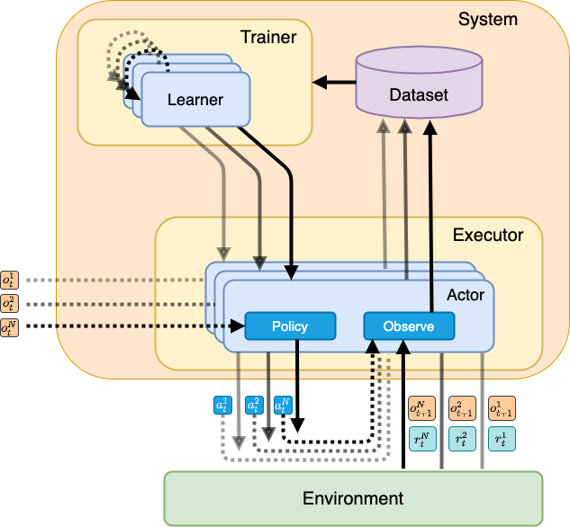

# Mava: a research framework for distributed multi-agent reinforcement learning


# Table of Contents
1. [Overview](#overview)
2. [Supported Environments](#supported-environments)
3. [System implementations](#system-implementations)
4. [Examples](#examples)
5. [Installation](#installation)
6. [Debugging](#debugging)
7. [Roadmap](#roadmap)
8. [Contributing](#contributing)
9. [Troubleshooting and FAQ](#troubleshooting-and-faqs)

<!-- **[Overview](#overview)** | **[Installation](#installation)** | **[Systems]** | **[Examples]** | -->

<!--  -->
<!--  -->


Mava is a library for building multi-agent reinforcement learning (MARL) systems. Mava builds off of [Acme][Acme] and in a similar way strives to expose simple, efficient, and readable components, as well as examples that serve both as reference implementations of popular algorithms and as strong
baselines, while still providing enough flexibility to do novel research.
## Overview
### Systems and the Executor-Trainer paradigm

At the core of the Mava framework is the concept of a `system`. A system refers to a full multi-agent reinforcement learning algorithm consisting of the following specific components: an `Executor`, a `Trainer` and a `Dataset`.

<p style="text-align:center;">

&nbsp;&nbsp;&nbsp;&nbsp;&nbsp;&nbsp;&nbsp;&nbsp;

</p>

The `Executor` is the part of the system that interacts with the environment, takes actions for each agent and observes the next state as a collection of observations, one for each agent in the system. Essentially, executors are the multi-agent version of the Actor class in Acme and are themselves constructed through feeding to the executor a dictionary of policy networks. The `Trainer` is responsible for sampling data from the Dataset originally collected from the executor and updating the parameters for every agent in the system. Trainers are therefore the multi-agent version of the Learner class in Acme. The `Dataset` stores all of the information collected by the executors in the form of a collection of dictionaries for the actions, observations and rewards with keys corresponding to the individual agent ids. The basic system design is shown on the left in the above figure.
Several examples of system implementations can be viewed [here][Systems].

### Distributed system training

Mava shares much of the design philosophy of Acme for the same reason: to allow a high level of composability for novel research (i.e. building new systems) as well as making it possible to scale systems in a simple way, using the same underlying multi-agent RL system code. Mava uses [Launchpad](launchpad) for creating distributed programs. In Mava, the system executor (which is responsible for data collection) is distributed across multiple processes each with a copy of the environment. Each process collects and stores data which the Trainer uses to update the parameters of all the actor networks used within each executor. This approach to distributed system training is illustrated on the right in the figure above.

## Supported environments

A given multi-agent system interacts with its environment via an `EnvironmentLoop`. This loop takes as input a `system` instance and a multi-agent `environment`
instance which implements the [DeepMind Environment API][dm_env]. Mava currently supports multi-agent environment loops and environment wrappers for the following environments and environment suites:

<figure >
    
</figure>

* [PettingZoo][pettingzoo]
* [SMAC][smac]
* [Flatland][flatland]
* [2D RoboCup][robocup]

The animation on the right shows MAD4PG solving the Multi-Walker environment from PettingZoo.

## System implementations

Mava includes several system implementations. Below we list these together with an indication of the maturity of the system using the following keys: 🟩  -- Tested and working well, 🟨  -- Running and training on simple environments, but not extensively tested and 🟥  -- Implemented but untested and yet to show clear signs of stable training.

* 🟩 - Multi-Agent Deep Q-Networks (MADQN).
* 🟩 - Multi-Agent Deep Deterministic Policy Gradient (MADDPG).
* 🟩 - Multi-Agent Distributed Distributional Deep Deterministic Policy Gradient (MAD4PG).
* 🟨 - Multi-Agent Proximal Policy Optimisation (MAPPO).
* 🟨 - Value Decomposition Networks (VDN).
* 🟥 - Monotonic value function factorisation (QMIX).

As we develop Mava further, we aim to have all systems well tested on a wide variety of environments.

## Examples

To get a sense of how Mava systems are used we provide the following simplified example of launching a distributed MADQN system.

```python
# Mava imports
from mava.systems.tf import madqn
from mava.components.tf.architectures import DecentralisedPolicyActor
from . import helpers

# Launchpad imports
import launchpad

# Distributed program
program = madqn.MADQN(
    environment_factory=helpers.environment_factory,
    network_factory=helpers.network_factory,
    architecture=DecentralisedPolicyActor,
    num_executors=2,
).build()

# Launch
launchpad.launch(
    program,
    launchpad.LaunchType.LOCAL_MULTI_PROCESSING,
)
```

The first two arguments to the program are environment and network factory functions.
These helper functions are responsible for creating the networks for the system, initialising their parameters on the different compute nodes and providing a copy of the environment for each executor. The next argument `num_executors` sets the number of executor processes to be run.
After building the program we feed it to Launchpad's `launch` function and specify the launch type to perform local multi-processing, i.e. running the distributed program on a single machine. Scaling up or down is simply a matter of adjusting the number of executor processes.

For a deeper dive, take a look at the detailed working code
examples found in our [examples] subdirectory which show how to instantiate a few MARL systems and environments.

### Components

Mava provides several components to support the design of MARL systems such as different system `architectures` and `modules`. You can change the architecture to support a different form of information sharing between agents, or add a module to enhance system capabilities. For example, you can update the above system code in MADQN to use a communication module by wrapping the architecture fed to the system as shown below.

```python
from mava.components.tf.modules import communication

...

# Wrap architecture in communication module
communication.BroadcastedCommunication(
    architecture=architecture,
    shared=True,
    channel_size=1,
    channel_noise=0,
)
```

All modules in Mava work in this way.

## Installation

We have tested `mava` on Python 3.6, 3.7 and 3.8.

### Docker (**Recommended**)

1. Build the docker image using the following make command:
    ```bash
    make build
    ```

2. Run an example:
    ```bash
    make run EXAMPLE=dir/to/example/example.py
    ```
    For example, `make run EXAMPLE=examples/petting_zoo/run_decentralised_feedforward_maddpg_continuous.py`. Alternatively, run bash inside a docker container with mava installed, `make bash`, and from there examples can be run as follows: `python dir/to/example/example.py`.

    To run an example with tensorboard viewing enabled, you can run
    ```bash
    make run-tensorboard EXAMPLE=dir/to/example/example.py
    ```
    and navigate to `http://127.0.0.1:6006/`.

3. Install multi-agent Starcraft 2 environment [Optional]:
    To install the environment, please run the provided bash script, which is a slightly modified version of the script found [here][pymarl].
    ```bash
    ./install_sc2.sh

3. Install 2D RoboCup environment [Optional]:
    To install the environment, please run the robocup docker build command after running the Mava docker build command.
    ```bash
    make build
    make build_robocup
    ```
### Python virtual environment

1.  If not using docker, we strongly recommend using a
    [Python virtual environment](https://docs.python.org/3/tutorial/venv.html)
    to manage your dependencies in order to avoid version conflicts. Please note that since Launchpad only supports Linux based OSes, using a python virtual environment will only work in these cases:

    ```bash
    python3 -m venv mava
    source mava/bin/activate
    pip install --upgrade pip setuptools
    ```

2.  To install the core libraries, including [Reverb](https://github.com/deepmind/reverb) - our storage dataset :

    ```bash
    pip install id-mava
    pip install id-mava[reverb]
    ```

    Or for nightly builds:
    ```bash
    pip install id-mava-nightly
    pip install id-mava-nightly[reverb]
    ```

3. To install dependencies for tensorflow agents:
    ```bash
    pip install id-mava[tf]
    ```
4. For distributed agent support:
    ```bash
    pip install id-mava[launchpad]
    ```

5. To install example environments, such as [PettingZoo](https://github.com/PettingZoo-Team/PettingZoo):
    ```bash
    pip install id-mava[envs]
    ```
6.  **NB**: For Flatland and SMAC environments, installations have to be done separately. Flatland can be installed using:

    ```bash
    pip install .[flatland]
    ```

    For StarCraft II installation, this must be installed separately according to your operating system.
    To install the StarCraft II ML environment and associated packages, please follow the instructions on [PySC2](https://github.com/deepmind/pysc2) to install the StarCraft II game files.
    Please ensure you have the required game maps (for both PySC2 and SMAC) extracted in the StarCraft II maps directory.
    Once this is done you can install the packages for the single agent case (PySC2) and the multi-agent case (SMAC).

    ```bash
    pip install pysc2
    pip install git+https://github.com/oxwhirl/smac.git
    ```
7.  For the 2D RoboCup environment, a local install has only been tested using the Ubuntu 18.04 operating system.
    The installation can be performed by running the RoboCup bash script while inside the Mava
    python virtual environment.
    ```bash
    ./install_robocup.sh
We also have a list of [optional installs](OPTIONAL_INSTALL.md) for extra functionality such as the use of Atari environments, environment wrappers, gpu support and agent episode recording.

## Debugging

<figure>
    
</figure>

To test and debug new system implementations, we use a simplified version of the spread environment from the [MPE][mpe] suite.
Debugging in MARL can be very difficult and time consuming, therefore it is important to use a small environment for debugging that is simple and fast but at the same time still able to clearly show whether a system is able to learn. An illustration of the debugging environment is shown on the right. Agents start at random locations and are assigned specific landmarks which they attempt to reach in as few steps as possible. Rewards are given to each agent independently as a function of their distance to the landmark. The reward is normalised to be between 0 and 1, where 1 is given when the agent is directly on top of the landmark. The further an agent is away from its landmark the more the reward value converges to 0. Collisions between agents result in a reward of -1 received by the colliding agents. To test both discrete and continuous control systems we feature two versions of the environment. In the discrete version the action space for each agent consists of the following five actions: `left`, `right`, `up`, `down`, `stand-still`. In the continuous case, the action space consists of real values bounded between -1 and 1 for the `acceleration` of the agent in the `x` and `y` direction. Several examples of running systems on the debugging environment can be found [here][debug]. Below we show the results from some of our systems trained on the debugging environment.

<p style="text-align:center;">


</p>

## Roadmap

We have big ambitions for Mava! 🚀 But there is still much work that needs to be done. We have a clear roadmap for expanding our system implementations and associated modules, improving testing and robustness and providing support for across-machine training. Furthermore, in the near future, we also plan to implement the following features (feel free to vote for any one of them by clicking on the name!).

[](https://api.gh-polls.com/poll/01F75ZJZXE8C5JM7MQWEX9PRXQ/Sequential%20environment%20support%20including%20OpenSpiel/vote) <br />
[](https://api.gh-polls.com/poll/01F75ZJZXE8C5JM7MQWEX9PRXQ/Population%20based%20training/vote) <br />
[](https://api.gh-polls.com/poll/01F75ZJZXE8C5JM7MQWEX9PRXQ/Dynamic%20networked%20architectures/vote)

In the slightly more longer term, the Mava team plans to release benchmarking results for several different systems and environments and contribute a MARL specific behavioural environment suite specifically engineered to study aspects of MARL such as cooperation and coordination.

## Contributing

Please read our [contributing docs](./CONTRIBUTING.md) for details on how to submit pull requests, our Contributor License Agreement and community guidelines.

## Troubleshooting and FAQs

Please read our [troubleshooting and FAQs guide](./TROUBLESHOOTING.md).
## Citing Mava

If you use Mava in your work, please cite the accompanying
[technical report][Paper]:

```bibtex
@article{anon2021mava,
    title={Mava: A Research Framework for Distributed Multi-Agent Reinforcement Learning},
    author={Anonymous authors},
    year={2021},
    journal={arXiv preprint},
    url={},
}
```

[Acme]: https://github.com/deepmind/acme
[Systems]: mava/systems/
[Examples]: examples
[debug]: examples/debugging_envs/
[Paper]: https://arxiv.org
[pettingzoo]: https://github.com/PettingZoo-Team/PettingZoo
[smac]: https://github.com/oxwhirl/smac
[openspiel]: https://github.com/deepmind/open_spiel
[flatland]: https://gitlab.aicrowd.com/flatland/flatland
[robocup]: https://github.com/rcsoccersim
[dm_env]: https://github.com/deepmind/dm_env
[pymarl]: https://github.com/oxwhirl/pymarl
[mpe]: https://github.com/openai/multiagent-particle-envs
[launchpad]: https://github.com/deepmind/launchpad
