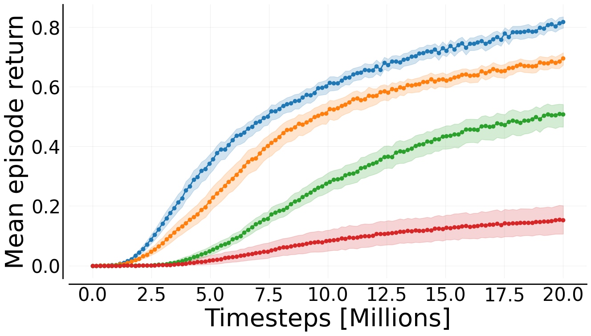
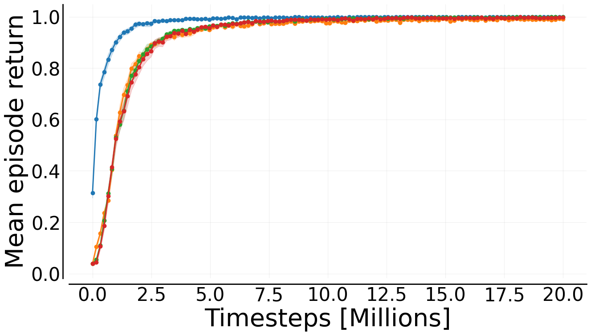
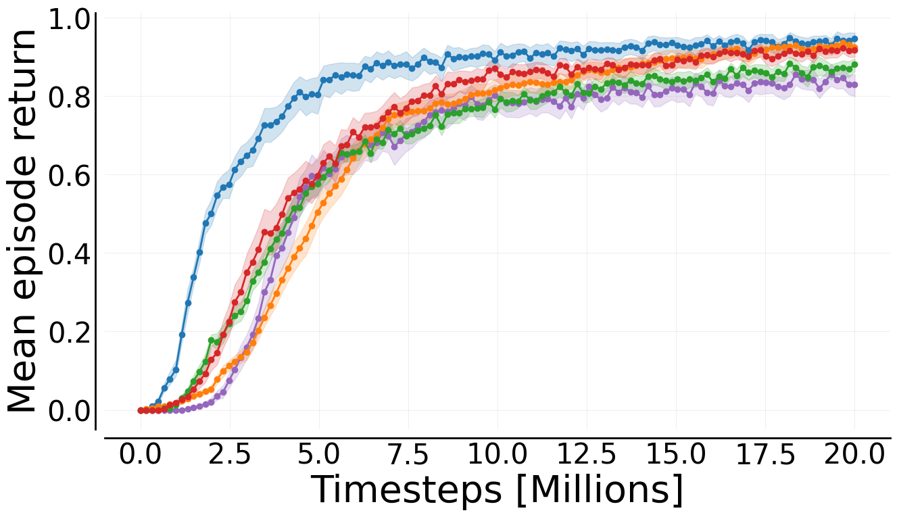
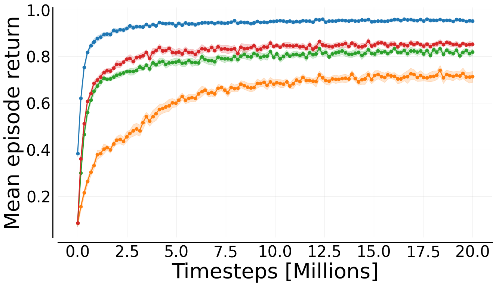
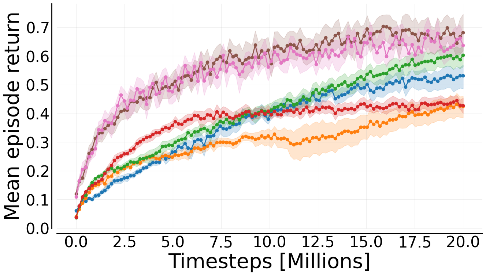
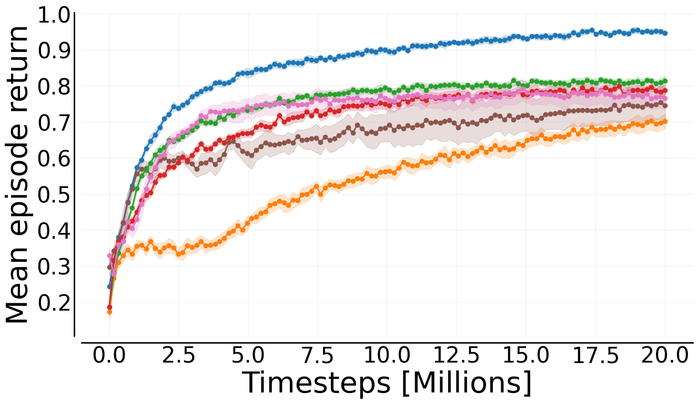

<p align="center">
    <a href="docs/images/mava_logos/mava_full_logo.png">
        
    </a>
</p>

<h2 align="center">
    <p>Distributed Multi-Agent Reinforcement Learning in JAX</p>
</h2>

<div align="center">
<a href="https://www.python.org/doc/versions/">
      
</a>
<a href="https://www.python.org/doc/versions/">
      
</a>
<a  href="https://github.com/instadeepai/Mava/blob/main/LICENSE">
    
</a>
<a href="https://arxiv.org/pdf/2107.01460.pdf">
    
</a>
<a href="https://colab.research.google.com/github/instadeepai/Mava/blob/develop/examples/Quickstart.ipynb" target="_parent"></a>
</div>

## Welcome to Mava! 🦁

<div align="center">
<h3>

[**Installation**](#installation-) | [**Getting started**](#getting-started-)

</div>

Mava allows researchers to experiment with multi-agent reinforcement learning (MARL) at lightning speed. The single-file JAX implementations are built for rapid research iteration - hack, modify, and test new ideas fast. Our [state-of-the-art algorithms][sable] scale seamlessly across devices. Created for researchers, by The Research Team at [InstaDeep](https://www.instadeep.com).

## Highlights 🦜

- 🥑 **Implementations of MARL algorithms**: Implementations of current state-of-the-art MARL algorithms that are distributed and effectively make use of available accelerators.
- 🍬 **Environment Wrappers**: We provide first class support to a few JAX based MARL environment suites through the use of wrappers, however new environments can be easily added by using existing wrappers as a guide.
- 🧪 **Statistically robust evaluation**: Mava natively supports logging to json files which adhere to the standard suggested by [Gorsane et al. (2022)][toward_standard_eval]. This enables easy downstream experiment plotting and aggregation using the tools found in the [MARL-eval][marl_eval] library.
- 🖥️ **Multi-agent Sebulba**: We maintain a sebulba versions of some of our algorithms allowing for speed ups even with non-Jax environments.
- ⚡ **Blazingly fast experiments**: All of the above allow for very quick runtime for our experiments, especially when compared to other non-JAX based MARL libraries.

## Installation 🎬

At the moment Mava is not meant to be installed as a library, but rather to be used as a research tool. We recommend cloning the Mava repo and pip installing as follows:

```bash
git clone https://github.com/instadeepai/mava.git
cd mava
pip install -e .
```

We have tested `Mava` on Python 3.11 and 3.12, but earlier versions may also work. Note that because the installation of JAX differs depending on your hardware accelerator,
we advise users to explicitly install the correct JAX version (see the [official installation guide](https://github.com/google/jax#installation)). For more in-depth installation guides including Docker builds and virtual environments, please see our [detailed installation guide](docs/DETAILED_INSTALL.md).

## Getting started ⚡

To get started with training your first Mava system, simply run one of the system files:

```bash
python mava/systems/ppo/anakin/ff_ippo.py
```

Mava makes use of Hydra for config management. In order to see our default system configs please see the `mava/configs/` directory. A benefit of Hydra is that configs can either be set in config yaml files or overwritten from the terminal on the fly. For an example of running a system on the LBF environment, the above code can simply be adapted as follows:

```bash
python mava/systems/ppo/anakin/ff_ippo.py env=lbf
```

Different scenarios can also be run by making the following config updates from the terminal:

```bash
python mava/systems/ff_ippo.py env=rware env/scenario=tiny-4ag
```

Additionally, we also have a [Quickstart notebook][quickstart] that can be used to quickly create and train your first Multi-agent system.

<details>
    <summary><h2>Algorithms</h2></summary>

| Algorithm  | Variants       | Continuous | Discrete | Anakin | Sebulba |
|------------|----------------|------------|----------|--------|---------|
| PPO        | [`ff_ippo.py`](https://github.com/instadeepai/Mava/blob/develop/mava/systems/ppo/anakin/ff_ippo.py)   | ✅         | ✅       | ✅     | ✅      |
|            | [`ff_mappo.py`](https://github.com/instadeepai/Mava/blob/develop/mava/systems/ppo/anakin/ff_mappo.py)  | ✅         | ✅       | ✅     |         |
|            | [`rec_ippo.py`](https://github.com/instadeepai/Mava/blob/develop/mava/systems/ppo/anakin/rec_ippo.py)  | ✅         | ✅       | ✅     |         |
|            | [`rec_mappo.py`](https://github.com/instadeepai/Mava/blob/develop/mava/systems/ppo/anakin/rec_mappo.py) | ✅         | ✅       | ✅     |         |
| Q Learning | [`rec_iql.py`](https://github.com/instadeepai/Mava/blob/develop/mava/systems/q_learning/anakin/rec_iql.py)   |            | ✅       | ✅     |         |
|            | [`rec_qmix.py`](https://github.com/instadeepai/Mava/blob/develop/mava/systems/q_learning/anakin/rec_qmix.py)  |            | ✅       | ✅     |         |
| SAC        | [`ff_isac.py`](https://github.com/instadeepai/Mava/blob/develop/mava/systems/sac/anakin/ff_isac.py)   | ✅         |          | ✅     |         |
|            | [`ff_masac.py`](https://github.com/instadeepai/Mava/blob/develop/mava/systems/sac/anakin/ff_masac.py)  | ✅         |          | ✅     |         |
|            | [`ff_hasac.py`](https://github.com/instadeepai/Mava/blob/develop/mava/systems/sac/anakin/ff_hasac.py)  | ✅         |          | ✅     |         |
| MAT        | [`mat.py`]()       | ✅         | ✅       | ✅     |         |
| Sable      | [`ff_sable.py`]()  | ✅         | ✅       | ✅     |         |
|            | [`rec_sable.py`]() | ✅         | ✅       | ✅     |         |
</details>
<details>
    <summary><h2>Environments</h2></summary>
        These are the environments which Mava supports _out of the box_, to add your own environments use the existing wrappers as an example. The framework indicates compatible agorithms, where Anakin algorithms work with JAX environments and Sebulba algorithms work with Numpy environments.

| Environment                     | Action space        | JAX | Numpy |
|---------------------------------|---------------------|-----|-------|
| Robot Warehouse                 | Discrete            | ✅   | ✅     |
| Level Based Foraging            | Discrete            | ✅   | ✅     |
| StarCraft Multi-Agent Challenge | Discrete            | ✅   | ✅     |
| MaBrax                          | Continuous          | ✅   |       |
| Matrax                          | Discrete            | ✅   |       |
| Multi-Particle-Envs             | Discrete/Continuous | ✅   |       |
</details>

## Performance and Speed 🚀
We have performed a rigorus benchmark over 45 different scenarios and 6 different environment suites to determine the performance of Mava's implementation. For more results please see the [Sable paper][sable].

<p align="center">
    <a href="docs/images/benchmark_results/rware.png">
        
    </a>
    <a href="docs/images/benchmark_results/lbf.png">
        
    </a>
    <a href="docs/images/benchmark_results/smax.png">
        
    </a>
    <a href="docs/images/benchmark_results/connector.png">
        
    </a>
    <a href="docs/images/benchmark_results/mabrax.png">
        
    </a>
    <a href="docs/images/benchmark_results/mpe.png">
        
    </a>
    <br>
    <a href="docs/images/benchmark_results/legend.jpg">
        
    </a>
    <div style="text-align:center; margin-top: 10px;"> Mava's algorithm performance, each algorithm was tuned for 40 trials with the TPE optimizer and benchmarked over 10 seeds for each scenario. Environments from top left Robot Warehouse (aggregated over 15 scenarios) Level Based Foraging (aggregated over 7 scenarios) SMAX (aggregated over 11 environments) Connector (aggregated over 4 environments) MaBrax (aggregated over 5 environments) Multi-Particle Env (aggregated over 3 environments)</div>
</p>

todo: speed plot - 1 bar plot: torch based vs anakin vs sebulba

## Code Philosophy 🧘

The current code in Mava is adapted from [PureJaxRL][purejaxrl] which provides high-quality single-file implementations with research-friendly features. In turn, PureJaxRL is inspired by the code philosophy from [CleanRL][cleanrl]. Along this vein of easy-to-use and understandable RL codebases, Mava is not designed to be a modular library and is not meant to be imported. Our repository focuses on simplicity and clarity in its implementations while utilising the advantages offered by JAX such as `pmap` and `vmap`, making it an excellent resource for researchers and practitioners to build upon. A noteable difference between Mava and CleanRL is that Mava creates small utilities for heavily re-used elements, such as networks and logging, we've found that this, in addition to hydra configs greatly improves the readability of the algorithms.

## Contributing 🤝

Please read our [contributing docs](docs/CONTRIBUTING.md) for details on how to submit pull requests, our Contributor License Agreement and community guidelines.

## Roadmap 🛤️

We plan to iteratively expand Mava in the following increments:

- Add sebulba versions of more algorithms

Please do follow along as we develop this next phase!

## See Also 🔎

**InstaDeep's MARL ecosystem in JAX.** In particular, we suggest users check out the following sister repositories:

- 🔌 [OG-MARL](https://github.com/instadeepai/og-marl): datasets with baselines for offline MARL in JAX.
- 🌴 [Jumanji](https://github.com/instadeepai/jumanji): a diverse suite of scalable reinforcement learning environments in JAX.
- 😎 [Matrax](https://github.com/instadeepai/matrax): a collection of matrix games in JAX.
- ⚡ [Flashbax](https://github.com/instadeepai/flashbax): accelerated replay buffers in JAX.
- 📈 [MARL-eval][marl_eval]: standardised experiment data aggregation and visualisation for MARL.

**Related.** Other libraries related to accelerated MARL in JAX.

- 🦊 [JaxMARL](https://github.com/flairox/jaxmarl): accelerated MARL environments with baselines in JAX.
- 🌀 [DeepMind Anakin][anakin_paper] for the Anakin podracer architecture to train RL agents at scale.
- ♟️ [Pgx](https://github.com/sotetsuk/pgx): JAX implementations of classic board games, such as Chess, Go and Shogi.
- 🔼 [Minimax](https://github.com/facebookresearch/minimax/): JAX implementations of autocurricula baselines for RL.

## Citing Mava 📚

If you use Mava in your work, please cite the accompanying
[technical report][Paper]:

```bibtex
@article{dekock2023mava,
    title={Mava: a research library for distributed multi-agent reinforcement learning in JAX},
    author={Ruan de Kock and Omayma Mahjoub and Sasha Abramowitz and Wiem Khlifi and Callum Rhys Tilbury
    and Claude Formanek and Andries P. Smit and Arnu Pretorius},
    year={2023},
    journal={arXiv preprint arXiv:2107.01460},
    url={https://arxiv.org/pdf/2107.01460.pdf},
}
```

## Acknowledgements 🙏

We would like to thank all the authors who contributed to the previous TF version of Mava: Kale-ab Tessera, St John Grimbly, Kevin Eloff, Siphelele Danisa, Lawrence Francis, Jonathan Shock, Herman Kamper, Willie Brink, Herman Engelbrecht, Alexandre Laterre, Karim Beguir. Their contributions can be found in our [TF technical report](https://arxiv.org/pdf/2107.01460v1.pdf).

The development of Mava was supported with Cloud TPUs from Google's [TPU Research Cloud](https://sites.research.google/trc/about/) (TRC) 🌤.

[Paper]: https://arxiv.org/pdf/2107.01460.pdf
[quickstart]: https://github.com/instadeepai/Mava/blob/develop/examples/Quickstart.ipynb
[jumanji]: https://github.com/instadeepai/jumanji
[cleanrl]: https://github.com/vwxyzjn/cleanrl
[purejaxrl]: https://github.com/luchris429/purejaxrl
[jumanji_rware]: https://instadeepai.github.io/jumanji/environments/robot_warehouse/
[jumanji_lbf]: https://github.com/sash-a/jumanji/tree/feat/lbf-truncate
[epymarl]: https://github.com/uoe-agents/epymarl
[anakin_paper]: https://arxiv.org/abs/2104.06272
[rware]: https://github.com/semitable/robotic-warehouse
[jaxmarl]: https://github.com/flairox/jaxmarl
[toward_standard_eval]: https://arxiv.org/pdf/2209.10485.pdf
[marl_eval]: https://github.com/instadeepai/marl-eval
[smax]: https://github.com/FLAIROx/JaxMARL/tree/main/jaxmarl/environments/smax
[sable]: https://arxiv.org/pdf/2410.01706
