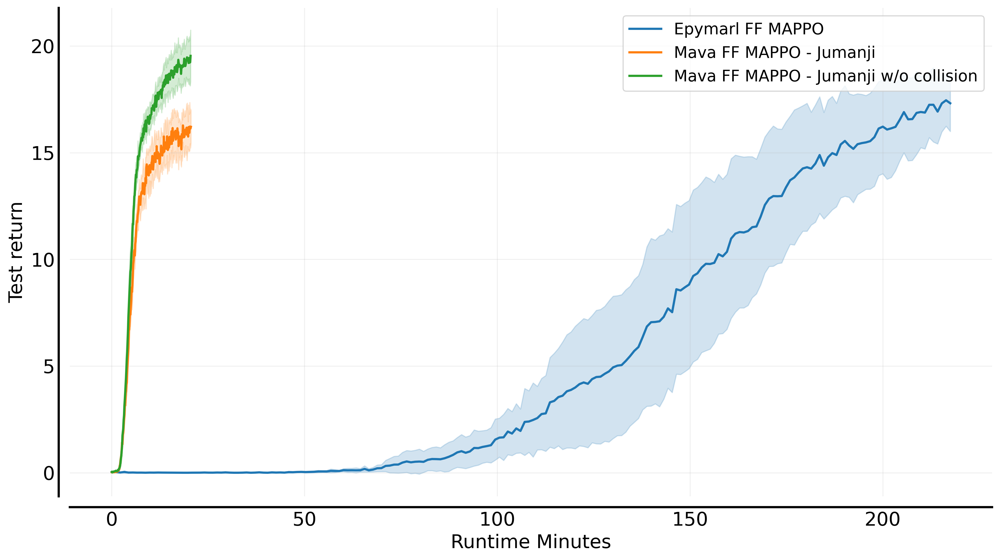
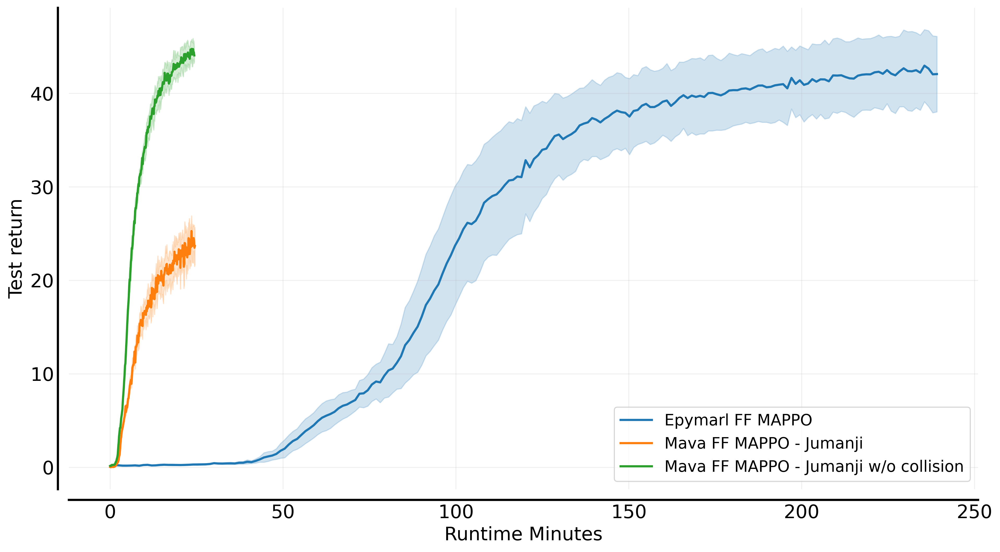
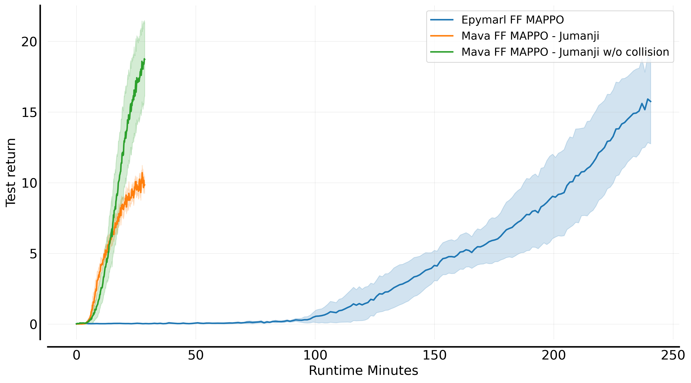
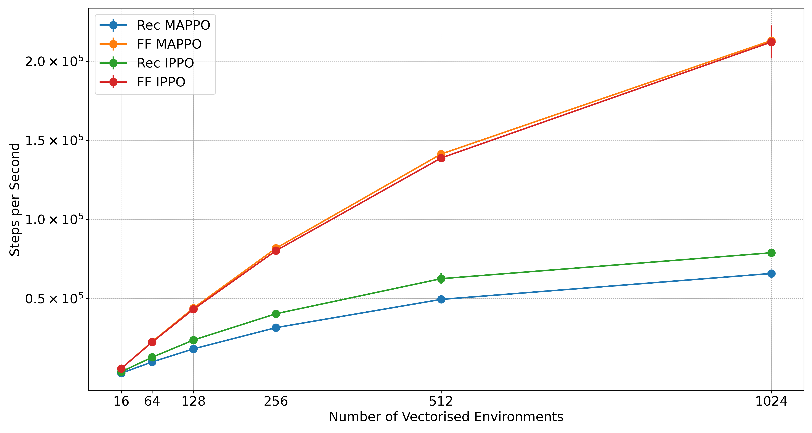
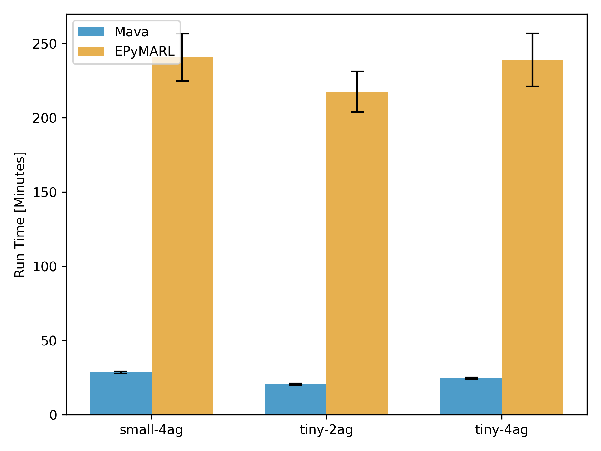

<p align="center">
    <a href="docs/images/mava_logos/mava_full_logo.png">
        
    </a>
</p>

<h2 align="center">
    <p>Distributed Multi-Agent Reinforcement Learning in JAX</p>
</h2>

<div align="center">
<!-- <a  href="https://pypi.org/project/id-mava/">
    
</a>
<a  href="https://pypi.org/project/id-mava/">
    
</a> -->
<!-- <a  href="https://github.com/instadeepai/Mava/actions/workflows/ci.yaml?query=branch%3Adevelop">
    
</a> -->
<a  href="https://github.com/instadeepai/Mava/blob/main/LICENSE">
    
</a>
<a  href="https://github.com/psf/black">
    
</a>
<a href="https://colab.research.google.com/github/instadeepai/Mava/blob/develop/examples/Quickstart.ipynb" target="_parent"></a>
</div>

<hr>

👋 **UPDATE - 25/8/2023**: _We have changed the focus of Mava away from a framework and more towards a lightweight and easy-to-use codebase for MARL._ Mava is also now end-to-end JAX-based and henceforth we will only be supporting JAX-based environments. We currently provide native support for the [Jumanji][jumanji] environment API. Mava now follows a similar design philosophy to [CleanRL][cleanrl] and [PureJaxRL][purejaxrl], where we allow for code duplication to enable readability and easy reuse. All algorithmic logic can be found in the file implementing a particular algorithm. If you would still like to use our deprecated TF2-based framework and systems please install [`v0.1.3`](https://github.com/instadeepai/Mava/releases/tag/0.1.3) of Mava (e.g. `pip install id-mava==0.1.3`).

<hr>

## Welcome to Mava! 🦁

<div align="center">
<h3>

[**Installation**](#installation-) | [**Quickstart**](#quickstart-)

</div>

Mava provides simplified code for quickly iterating on ideas in multi-agent reinforcement learning (MARL) with useful implementations of MARL algorithms in JAX allowing for easy parallelisation across devices with JAX's `pmap`. Mava is a project originating in the Research Team at [InstaDeep](https://www.instadeep.com/).

To join us in these efforts, please feel free to reach out, raise issues or read our [contribution guidelines](#contributing-) (or just star 🌟 to stay up to date with the latest developments)!

## Overview 🦜

Mava currently offers the following building blocks for MARL research:

- 🥑 **Implementations of MARL algorithms**: Implementations of multi-agent PPO systems that follow both the Centralised Training with Decentralised Execution (CTDE) and Decentralised Training with Decentralised Execution (DTDE) MARL paradigms.
- 🍬 **Environment Wrappers**: Example wrapper for mapping a Jumanji environment to an environment usable in Mava. At the moment, we only support [Robotic Warehouse][jumanji_rware] but plan to support more environments soon.
- 🎓 **Educational Material**: [Quickstart notebook][quickstart] to demonstrate how Mava can be used and to highlight the added value of JAX-based MARL.

## Performance and Speed 🚀

All of the experiments below were performed using an NVIDIA Quadro RTX 4000 GPU with 8GB Memory.

In order to show the utility of end-to-end JAX-based MARL systems and JAX-based environments we compare the speed of Mava against [EPyMARL][epymarl] as measured in total training wallclock time on simple [Robotic Warehouse][rware] (RWARE) tasks with 2 and 4 agents. Our aim is to illustrate the speed increases that are possible with using end-to-end Jax-based systems and we do not necessarily make an effort to achieve optimal performance. For EPyMARL, we use the hyperparameters as recommended by [Papoudakis et al. (2020)](https://arxiv.org/pdf/2006.07869.pdf) and for Mava we performed a basic grid search. In both cases, systems were trained up to 20 million total environment steps using 16 vectorised environments.

<p align="center">
    <a href="docs/images/rware_results/ff_mappo/tiny-2ag.png">
        
    </a>
    <a href="docs/images/rware_results/ff_mappo/tiny-4ag.png">
        
    </a>
    <a href="docs/images/rware_results/ff_mappo/small-4ag.png">
        
    </a>
    <br>
    <div style="text-align:center; margin-top: 10px;"> Mava feedforward MAPPO performance on the <code>tiny-2ag</code>, <code>tiny-4ag</code> and <code>small-4ag</code> RWARE tasks.</div>
</p>

### 📌 An important note on the differences in converged performance

In order to benefit from the wallclock speed-ups afforded by JAX-based systems it is required that environments also be written in JAX. It is for this reason that Mava does not use the exact same version of the RWARE environment as EPyMARL but instead uses a JAX-based implementation of RWARE found in [Jumanji][jumanji_rware], under the name RobotWarehouse. One of the notable differences in the underlying environment logic is that RobotWarehouse will not attempt to resolve agent collisions but will instead terminate an episode when agents do collide. In our experiments, this appeared to make the environment more challenging. For this reason we show the performance of Mava on Jumanji with and without termination upon collision indicated with `w/o collision` in the figure legends. For a more detailed discussion, please see the following [page](docs/jumanji_rware_comparison.md).

### 🧨 Steps per second experiments using vectorised environments

Furthermore, we illustrate the speed of Mava by showing the steps per second as the number of parallel environments is increased. These steps per second scaling plots were computed using a standard laptop GPU, specifically an RTX-3060 GPU with 6GB memory.

<p align="center">
    <a href="docs/images/speed_results/mava_sps_results.png">
        
    </a>
    <a href="docs/images/speed_results/ff_mappo_speed_comparison.png">
        
    </a>
    <br>
    <div style="text-align:center; margin-top: 10px;"> Mava steps per second scaling with increased vectorised environments and total training run time for 20M environment steps.</div>
</p>

## Code Philosophy 🧘

The current code in Mava is adapted from [PureJaxRL](purejaxrl) which provides high-quality single-file implementations with research-friendly features. In turn, PureJaxRL is inspired by the code philosophy from [CleanRL][cleanrl]. Along this vein of easy-to-use and understandable RL codebases, Mava is not designed to be a modular library and is not meant to be imported. Our repository focuses on simplicity and clarity in its implementations while utilising the advantages offered by JAX such as `pmap` and `vmap`, making it an excellent resource for researchers and practitioners to build upon.

## Installation 🎬

At the moment Mava is not meant to be installed as a library, but rather to be used as a research tool.

You can use Mava by cloning the repo and pip installing as follows:

```bash
git clone https://github.com/instadeepai/mava.git
cd mava
pip install -e .
```

We have tested `Mava` on Python 3.9. Note that because the installation of JAX differs depending on your hardware accelerator,
we advise users to explicitly install the correct JAX version (see the [official installation guide](https://github.com/google/jax#installation)). For more in-depth installation guides including Docker builds and virtual environments, please see our [detailed installation guide](docs/DETAILED_INSTALL.md).

## Quickstart ⚡

We have a [Quickstart notebook][quickstart] that can be used to quickly create and train your first Multi-Agent System.

## Contributing 🤝

Please read our [contributing docs](docs/CONTRIBUTING.md) for details on how to submit pull requests, our Contributor License Agreement and community guidelines.

## Roadmap 🛤️

We plan to iteratively expand Mava in the following increments:

- 🌴 Support for more multi-agent Jumanji environments.
- 🔁 More robust recurrent systems.
- 📊 Benchmarks on more environments.
- 🦾 Support for off-policy algorithms.

Please do follow along as we develop this next phase!

## See Also 🔎

The current version of Mava has been based on code from the following projects:

- 🤖 [PureJaxRL][purejaxrl] for simple code implementations of end-to-end RL training in JAX.
- 🌀 [DeepMind Anakin][anakin_paper] for the Anakin podracer architecture to train RL agents at scale.
- 🌴 [Jumanji][jumanji] a diverse suite of scalable RL environments written in JAX, including multi-agent environments.

## Citing Mava 📚

If you use Mava in your work, please cite the accompanying
[technical report][Paper] (to be updated soon to reflect our transition to JAX):

```bibtex
@article{pretorius2021mava,
    title={Mava: A Research Framework for Distributed Multi-Agent Reinforcement Learning},
    author={Arnu Pretorius and Kale-ab Tessera and Andries P. Smit and Kevin Eloff
    and Claude Formanek and St John Grimbly and Siphelele Danisa and Lawrence Francis
    and Jonathan Shock and Herman Kamper and Willie Brink and Herman Engelbrecht
    and Alexandre Laterre and Karim Beguir},
    year={2021},
    journal={arXiv preprint arXiv:2107.01460},
    url={https://arxiv.org/pdf/2107.01460.pdf},
}
```

[Paper]: https://arxiv.org/pdf/2107.01460.pdf
[quickstart]: https://github.com/instadeepai/Mava/blob/develop/examples/Quickstart.ipynb
[jumanji]: https://github.com/instadeepai/jumanji
[cleanrl]: https://github.com/vwxyzjn/cleanrl
[purejaxrl]: https://github.com/luchris429/purejaxrl
[jumanji_rware]: https://instadeepai.github.io/jumanji/environments/robot_warehouse/
[epymarl]: https://github.com/uoe-agents/epymarl
[anakin_paper]: https://arxiv.org/abs/2104.06272
[rware]: https://github.com/semitable/robotic-warehouse
