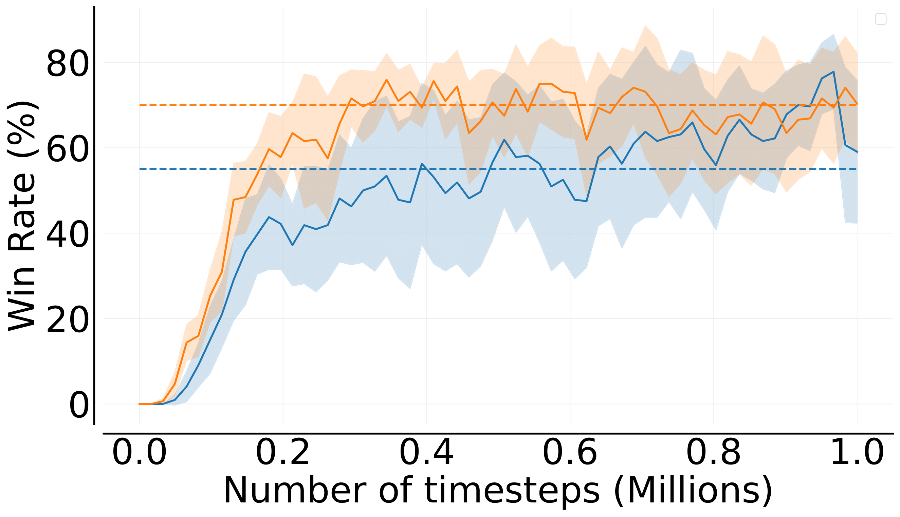
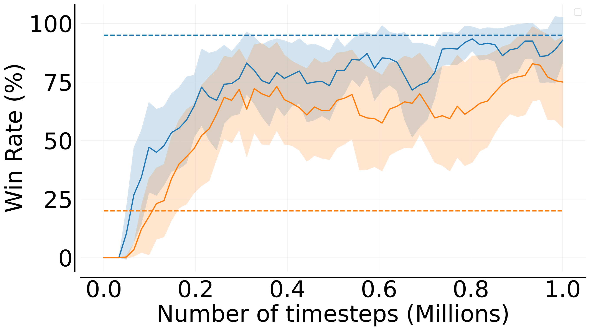
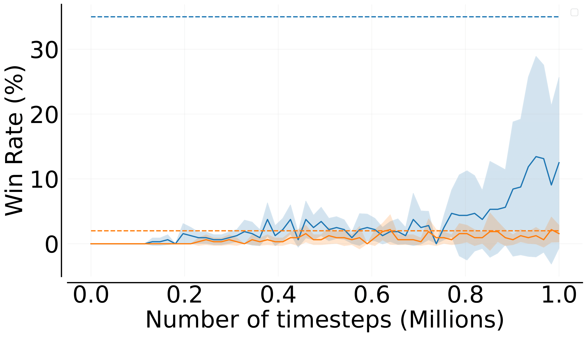
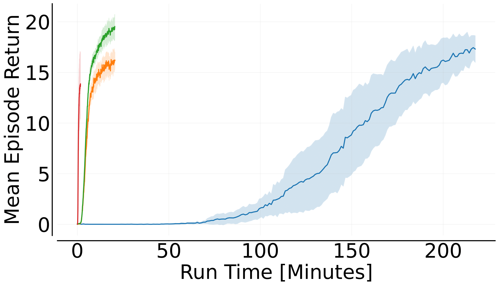
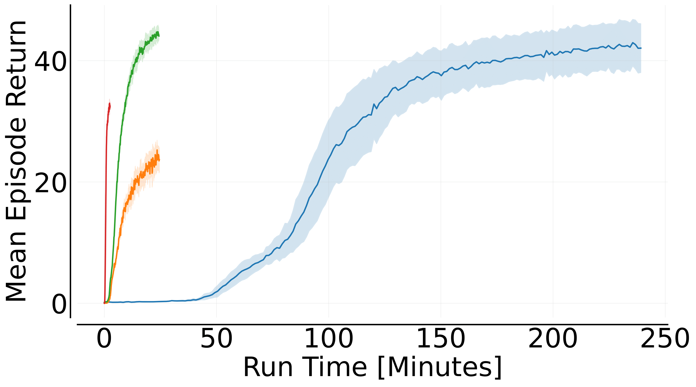
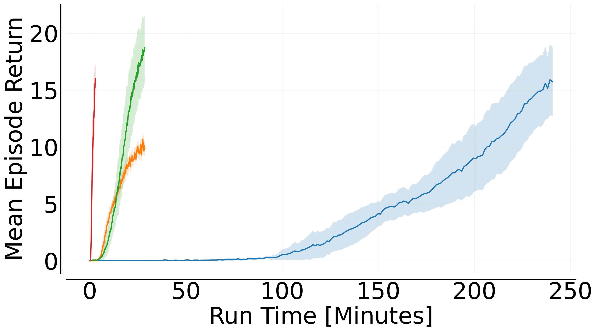
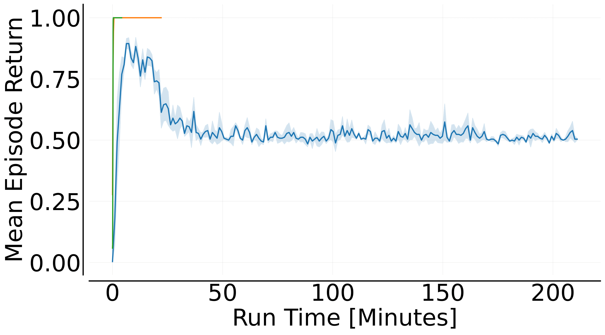
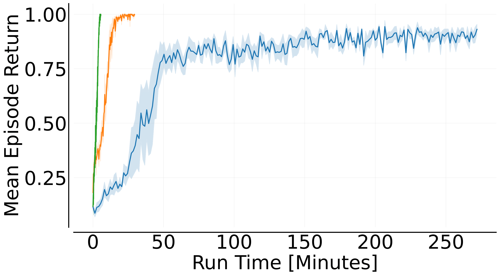

<p align="center">
    <a href="docs/images/mava_logos/mava_full_logo.png">
        
    </a>
</p>

<h2 align="center">
    <p>Distributed Multi-Agent Reinforcement Learning in JAX</p>
</h2>

<div align="center">
<a href="https://www.python.org/doc/versions/">
      
</a>
<a  href="https://github.com/instadeepai/Mava/blob/main/LICENSE">
    
</a>
<a  href="https://github.com/psf/black">
    
</a>
<a  href="http://mypy-lang.org/">
    
</a>
<a href="https://arxiv.org/pdf/2107.01460.pdf">
    
</a>
<a href="https://colab.research.google.com/github/instadeepai/Mava/blob/develop/examples/Quickstart.ipynb" target="_parent"></a>
</div>

## Welcome to Mava! 🦁

<div align="center">
<h3>

[**Installation**](#installation-) | [**Quickstart**](#quickstart-)

</div>

Mava provides simplified code for quickly iterating on ideas in multi-agent reinforcement learning (MARL) with useful implementations of MARL algorithms in JAX allowing for easy parallelisation across devices with JAX's `pmap`. Mava is a project originating in the Research Team at [InstaDeep](https://www.instadeep.com/).

To join us in these efforts, please feel free to reach out, raise issues or read our [contribution guidelines](#contributing-) (or just star 🌟 to stay up to date with the latest developments)!

## Overview 🦜

Mava currently offers the following building blocks for MARL research:

- 🥑 **Implementations of MARL algorithms**: Implementations of multi-agent PPO systems that follow both the Centralised Training with Decentralised Execution (CTDE) and Decentralised Training with Decentralised Execution (DTDE) MARL paradigms with support for continuous and discrete action space environments.
- 🍬 **Environment Wrappers**: Example wrappers for mapping Jumanji environments to an environment that is compatible with Mava. At the moment, we support [Robotic Warehouse][jumanji_rware] and [Level-Based Foraging][jumanji_lbf] with plans to support more environments soon. We have also recently added support for the SMAX and MaBrax environments from [JaxMARL][jaxmarl].
- 🎓 **Educational Material**: [Quickstart notebook][quickstart] to demonstrate how Mava can be used and to highlight the added value of JAX-based MARL.
- 🧪 **Statistically robust evaluation**: Mava natively supports logging to json files which adhere to the standard suggested by [Gorsane et al. (2022)][toward_standard_eval]. This enables easy downstream experiment plotting and aggregation using the tools found in the [MARL-eval][marl_eval] library.

## Performance and Speed 🚀

### SMAX
For comparing Mava’s stability to other JAX-based baseline algorithms, we train Mava’s recurrent IPPO and MAPPO systems on a broad range of [SMAX][smax] tasks. In all cases we do not rerun baselines but instead take results for final win rates from the [JaxMARL technical report](https://arxiv.org/pdf/2311.10090.pdf). For the full SMAX experiments results, please see the following [page](docs/smax_benchmark.md).

<p align="center">
 <a href="docs/images/smax_results/legend.png">
        
</a>
</p>

<p align="center">
    <a href="docs/images/smax_results/3s5z.png">
        
    </a>
    <a href="docs/images/smax_results/6h_vs_8z.png">
        
    </a>
    <a href="docs/images/smax_results/3s5z_vs_3s6z.png">
        
    </a>
    <br>
    <div style="text-align:center; margin-top: 10px;"> Mava Recurrent IPPO and MAPPO performance on the <code>3s5z</code>, <code>6h_vs_8z</code> and <code>3s5z_vs_3s6z</code> SMAX tasks.</div>
</p>

### Robotic Warehouse

All of the experiments below were performed using an NVIDIA Quadro RTX 4000 GPU with 8GB Memory.

In order to show the utility of end-to-end JAX-based MARL systems and JAX-based environments we compare the speed of Mava against [EPyMARL][epymarl] as measured in total training wallclock time on simple [Robotic Warehouse][rware] (RWARE) tasks with 2 and 4 agents. Our aim is to illustrate the speed increases that are possible with using end-to-end Jax-based systems and we do not necessarily make an effort to achieve optimal performance. For EPyMARL, we use the hyperparameters as recommended by [Papoudakis et al. (2020)](https://arxiv.org/pdf/2006.07869.pdf) and for Mava we performed a basic grid search. In both cases, systems were trained up to 20 million total environment steps using 16 vectorised environments.

<p align="center">
 <a href="docs/images/rware_results/ff_mappo/main_readme/legend.png">
        
</a>
</p>

<p align="center">
    <a href="docs/images/rware_results/ff_mappo/main_readme/tiny-2ag-1.png">
        
    </a>
    <a href="docs/images/rware_results/ff_mappo/main_readme/tiny-4ag-1.png">
        
    </a>
    <a href="docs/images/rware_results/ff_mappo/main_readme/small-4ag-1.png">
        
    </a>
    <br>
    <div style="text-align:center; margin-top: 10px;"> Mava feedforward MAPPO performance on the <code>tiny-2ag</code>, <code>tiny-4ag</code> and <code>small-4ag</code> RWARE tasks.</div>
</p>


### 📌 An important note on the differences in converged performance

In order to benefit from the wallclock speed-ups afforded by JAX-based systems it is required that environments also be written in JAX. It is for this reason that Mava does not use the exact same version of the RWARE environment as EPyMARL but instead uses a JAX-based implementation of RWARE found in [Jumanji][jumanji_rware], under the name RobotWarehouse. One of the notable differences in the underlying environment logic is that RobotWarehouse will not attempt to resolve agent collisions but will instead terminate an episode when agents do collide. In our experiments, this appeared to make the environment more challenging. For this reason we show the performance of Mava on Jumanji with and without termination upon collision indicated with `w/o collision` in the figure legends. For a more detailed discussion, please see the following [page](docs/jumanji_rware_comparison.md).

### Level-Based Foraging
Mava also supports [Jumanji][jumanji_lbf]'s LBF. We evaluate Mava's recurrent MAPPO system on LBF, against [EPyMARL][epymarl] (we used original [LBF](https://github.com/semitable/lb-foraging) for EPyMARL) in 2 and 4 agent settings up to 20 million timesteps. Both systems were trained using 16 vectorized environments. For the EPyMARL systems we use a NVIDIA A100 GPU and for the Mava systems we use a GeForce RTX 3050 laptop GPU with 4GB of memory. To show how Mava can generalise to different hardware, we also train the Mava systems on a TPU v3-8. We plan to publish comprehensive performance benchmarks for all Mava's algorithms across various LBF scenarios soon.

<p align="center">
 <a href="docs/images/lbf_results/legend_rec_mappo.png">
        
</a>
</p>

<p align="center">
    <a href="docs/images/lbf_results/2s-8x8-2p-2f-coop_rec_mappo.png">
        
    </a>
    <a href="docs/images/lbf_results/15x15-4p-3f_rec_mappo.png">
        
    </a>
    <br>
    <div style="text-align:center; margin-top: 10px;"> Mava Recurrent MAPPO performance on the <code>2s-8x8-2p-2f-coop</code>, and <code>15x15-4p-3fz</code> Level-Based Foraging tasks.</div>
</p>

### 🧨 Steps per second experiments using vectorised environments

Furthermore, we illustrate the speed of Mava by showing the steps per second as the number of parallel environments is increased. These steps per second scaling plots were computed using a standard laptop GPU, specifically an RTX-3060 GPU with 6GB memory.

<p align="center">
    <a href="docs/images/speed_results/mava_sps_results.png">
        
    </a>
    <a href="docs/images/speed_results/ff_mappo_speed_comparison.png">
        
    </a>
    <br>
    <div style="text-align:center; margin-top: 10px;"> Mava steps per second scaling with increased vectorised environments and total training run time for 20M environment steps.</div>
</p>

## Code Philosophy 🧘

The current code in Mava is adapted from [PureJaxRL][purejaxrl] which provides high-quality single-file implementations with research-friendly features. In turn, PureJaxRL is inspired by the code philosophy from [CleanRL][cleanrl]. Along this vein of easy-to-use and understandable RL codebases, Mava is not designed to be a modular library and is not meant to be imported. Our repository focuses on simplicity and clarity in its implementations while utilising the advantages offered by JAX such as `pmap` and `vmap`, making it an excellent resource for researchers and practitioners to build upon. A notable difference between Mava and other single-file libraries is that Mava makes use of abstraction where relevant. In particular, this is done for network and environment creation.

## Installation 🎬

At the moment Mava is not meant to be installed as a library, but rather to be used as a research tool.

You can use Mava by cloning the repo and pip installing as follows:

```bash
git clone https://github.com/instadeepai/mava.git
cd mava
pip install -e .
```

We have tested `Mava` on Python 3.9. Note that because the installation of JAX differs depending on your hardware accelerator,
we advise users to explicitly install the correct JAX version (see the [official installation guide](https://github.com/google/jax#installation)). For more in-depth installation guides including Docker builds and virtual environments, please see our [detailed installation guide](docs/DETAILED_INSTALL.md).

## Quickstart ⚡

To get started with training your first Mava system, simply run one of the system files. e.g.,

```bash
python mava/systems/ppo/ff_ippo.py
```

Mava makes use of Hydra for config management. In order to see our default system configs please see the `mava/configs/` directory. A benefit of Hydra is that configs can either be set in config yaml files or overwritten from the terminal on the fly. For an example of running a system on the LBF environment, the above code can simply be adapted as follows:

```bash
python mava/systems/ppo/ff_ippo.py env=lbf
```

Different scenarios can also be run by making the following config updates from the terminal:

```bash
python mava/systems/ppo/ff_ippo.py env=rware env/scenario=tiny-4ag
```

To toggle between continuous and discrete systems, simply select the continuous action space network head. To run the same system on an `MaBrax` environment make the follow config updates from the terminal:

```bash
python mava/systems/ppo/ff_ippo.py env=mabrax network.action_head._target_="mava.networks.ContinuousActionHead"
```

Additionally, we also have a [Quickstart notebook][quickstart] that can be used to quickly create and train your first Multi-agent system.

## Advanced Usage 👽

Mava can be used in a wide array of advanced systems. As an example, we demonstrate recording experience data from one of our PPO systems into a [Flashbax](https://github.com/instadeepai/flashbax) `Vault`. This vault can then easily be integrated into offline MARL systems, such as those found in [OG-MARL](https://github.com/instadeepai/og-marl). See the [Advanced README](./mava/advanced_usage/) for more information.

## Contributing 🤝

Please read our [contributing docs](docs/CONTRIBUTING.md) for details on how to submit pull requests, our Contributor License Agreement and community guidelines.

## Roadmap 🛤️

We plan to iteratively expand Mava in the following increments:

- 🌴 Support for more environments.
- 🌳 Support for non JAX-based environments.
- 🦾 Support for off-policy algorithms.

Please do follow along as we develop this next phase!

## TensorFlow 2 Mava:
Originally Mava was written in Tensorflow 2. Support for the TF2-based framework and systems has now been fully **deprecated**. If you would still like to use it, please install `v0.1.3` of Mava (i.e. `pip install id-mava==0.1.3`).

## See Also 🔎

**InstaDeep's MARL ecosystem in JAX.** In particular, we suggest users check out the following sister repositories:

- 🔌 [OG-MARL](https://github.com/instadeepai/og-marl): datasets with baselines for offline MARL in JAX.
- 🌴 [Jumanji](https://github.com/instadeepai/jumanji): a diverse suite of scalable reinforcement learning environments in JAX.
- 😎 [Matrax](https://github.com/instadeepai/matrax): a collection of matrix games in JAX.
- ⚡ [Flashbax](https://github.com/instadeepai/flashbax): accelerated replay buffers in JAX.
- 📈 [MARL-eval][marl_eval]: standardised experiment data aggregation and visualisation for MARL.

**Related.** Other libraries related to accelerated MARL in JAX.

- 🦊 [JaxMARL](https://github.com/flairox/jaxmarl): accelerated MARL environments with baselines in JAX.
- 🌀 [DeepMind Anakin][anakin_paper] for the Anakin podracer architecture to train RL agents at scale.
- ♟️ [Pgx](https://github.com/sotetsuk/pgx): JAX implementations of classic board games, such as Chess, Go and Shogi.
- 🔼 [Minimax](https://github.com/facebookresearch/minimax/): JAX implementations of autocurricula baselines for RL.

## Citing Mava 📚

If you use Mava in your work, please cite the accompanying
[technical report][Paper]:

```bibtex
@article{dekock2023mava,
    title={Mava: a research library for distributed multi-agent reinforcement learning in JAX},
    author={Ruan de Kock and Omayma Mahjoub and Sasha Abramowitz and Wiem Khlifi and Callum Rhys Tilbury
    and Claude Formanek and Andries P. Smit and Arnu Pretorius},
    year={2023},
    journal={arXiv preprint arXiv:2107.01460},
    url={https://arxiv.org/pdf/2107.01460.pdf},
}
```

## Acknowledgements 🙏

We would like to thank all the authors who contributed to the previous TF version of Mava: Kale-ab Tessera, St John Grimbly, Kevin Eloff, Siphelele Danisa, Lawrence Francis, Jonathan Shock, Herman Kamper, Willie Brink, Herman Engelbrecht, Alexandre Laterre, Karim Beguir. Their contributions can be found in our [TF technical report](https://arxiv.org/pdf/2107.01460v1.pdf).

The development of Mava was supported with Cloud TPUs from Google's [TPU Research Cloud](https://sites.research.google/trc/about/) (TRC) 🌤.

[Paper]: https://arxiv.org/pdf/2107.01460.pdf
[quickstart]: https://github.com/instadeepai/Mava/blob/develop/examples/Quickstart.ipynb
[jumanji]: https://github.com/instadeepai/jumanji
[cleanrl]: https://github.com/vwxyzjn/cleanrl
[purejaxrl]: https://github.com/luchris429/purejaxrl
[jumanji_rware]: https://instadeepai.github.io/jumanji/environments/robot_warehouse/
[jumanji_lbf]: https://github.com/sash-a/jumanji/tree/feat/lbf-truncate
[epymarl]: https://github.com/uoe-agents/epymarl
[anakin_paper]: https://arxiv.org/abs/2104.06272
[rware]: https://github.com/semitable/robotic-warehouse
[jaxmarl]: https://github.com/flairox/jaxmarl
[toward_standard_eval]: https://arxiv.org/pdf/2209.10485.pdf
[marl_eval]: https://github.com/instadeepai/marl-eval
[smax]: https://github.com/FLAIROx/JaxMARL/tree/main/jaxmarl/environments/smax
