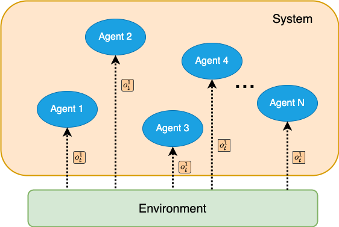
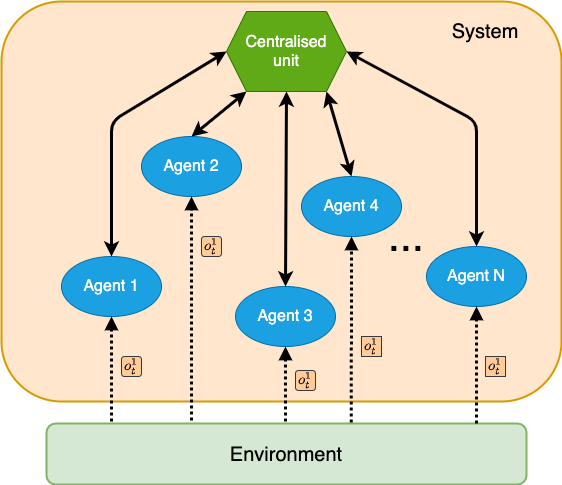
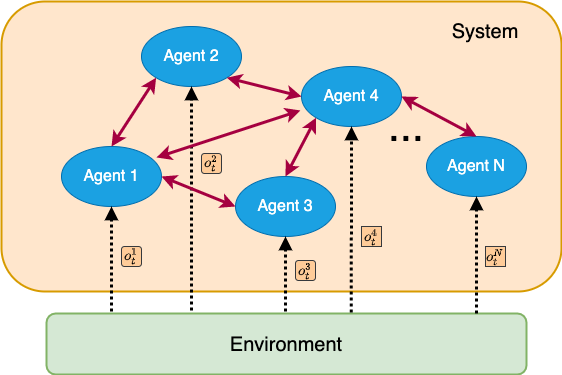

## Architectures

### Decentralised

<p style="text-align:center;">

</p>


### Centralised

<p style="text-align:center;">

</p>

### Networked

<p style="text-align:center;">

</p>


<!-- The unique dependencies for this set of environments can be installed via:

````bash
pip install pettingzoo[butterfly]
````

All butterfly environments were created by us using PyGame with visual Atari spaces. In Prison, all agents are completely independent (i.e. no coordination is possible, each agent is in it's own cell). It is intended as a debugging tool.

All other environments require a high degree of coordination and require learning of emergent behaviors to achieve an optimal policy. As such, these environments are currently very challenging to learn.

All environments are highly configurable via arguments specified in each environment's documentation. -->
