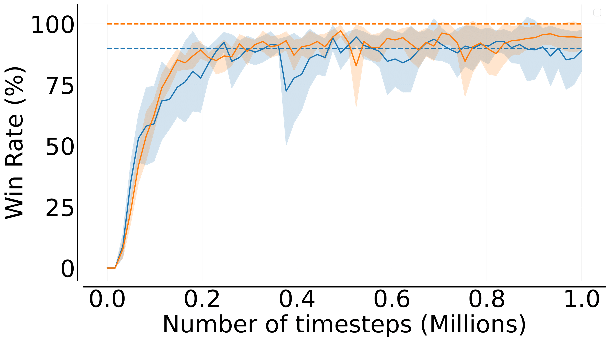
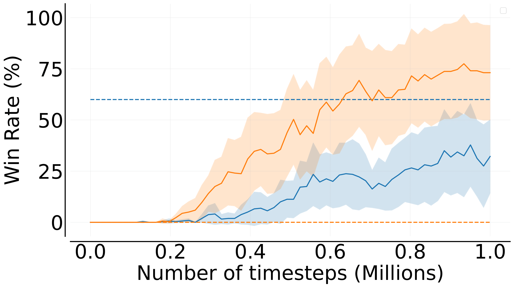
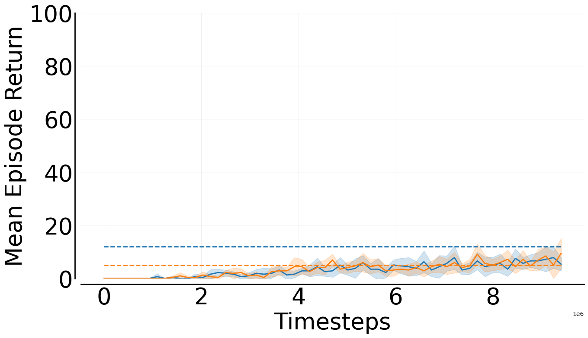
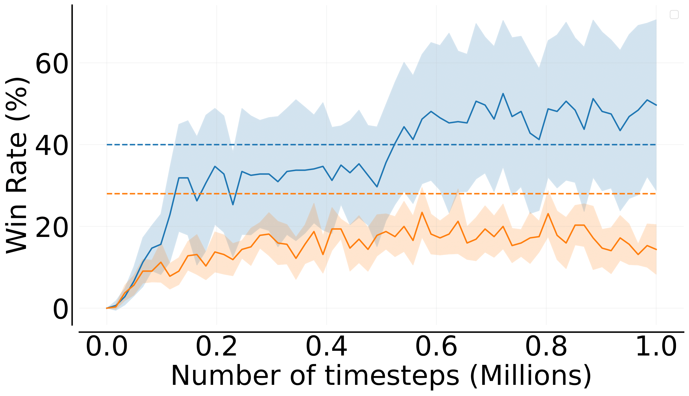
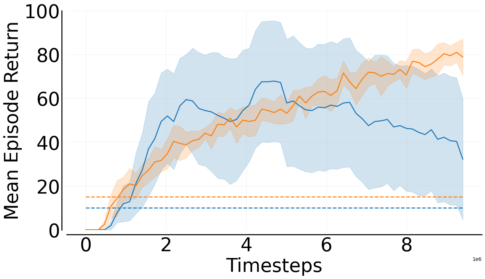

# StarCraft Multi-Agent Challenge in JAX

We trained Mava’s recurrent systems on eight varied SMAX scenarios, We executed a tuning sweep to identify the optimal hyperparameters for each scenario, followed by a benchmarking. The outcomes were then compared to the final win rates reported in [Rutherfordet al., 2023](https://arxiv.org/pdf/2311.10090.pdf). To ensure equitable comparisons, we adhered to specific criteria, including training over 10 million timesteps, utilising 64 parallel environments, and employing 10 different seeds.

Please see below for Mava's recurrent IPPO and MAPPO performance on these scenarios.
 
 

 

<table>
<tr>
    <td></td>
    <td></td>
    <td></td>
</tr>
<tr>
    <td style="text-align:center"><code>2s3z</code></td>
    <td style="text-align:center"><code>23s_vs_5z</code></td>
    <td style="text-align:center"><code>3s5z_vs_3s6z</code></td>
</tr>
<tr>
    <td></td>
    <td></td>
    <td></td>
</tr>
<tr>
    <td style="text-align:center"><code>3s5z</code></td>
    <td style="text-align:center"><code>5m_vs_6m</code></td>
    <td style="text-align:center"><code>6h_vs_8z</code></td>
</tr>
<tr>
    <td></td>
    <td></td>
</tr>
<tr>
    <td style="text-align:center"><code>10m_vs_11m</code></td>
    <td style="text-align:center"><code>27m_vs_30m</code></td>
</tr>
</table>

