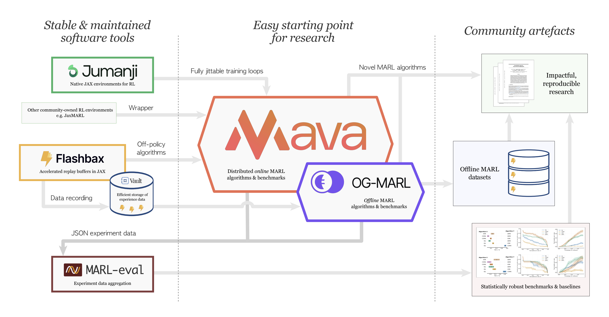

## The Ecosystem

    

## Using Mava

## The Anakin Architecture

Mava currently supports environments written in JAX, allowing for just-in-time compilation of agent policy roll-outs and updates.
It specifically supports the [Anakin architecture](https://arxiv.org/abs/2104.06272) for scalable distributed system training on hardware accelerators.

Mava implements both recurrent and feedforward policy versions of multi-agent Proximal Policy Optimization (PPO) systems, following the paradigms of decentralised training with decentralised execution (DTDE) and centralised training with decentralised execution (CTDE).

    

**Introduction**

The Anakin podracer architecture is implemented in Mava for fast training on hardware accelerators such as a GPU or TPU.
It begins with a set of parameters $\theta$ as input, which are replicated across $D$ devices.
Each device $d \in D$ receives these parameters via `jax.pmap`.

**Parameter Distribution and Replication**

On each device $d$, the parameters are further broadcast to $J$ update functions via `jax.vmap`.

**Update Function Execution**

Each update function $j \in J$ then generates independent experiences from $N$ copies of the environment via `jax.vmap`.
These experiences are collected and used by a loss function to compute gradients.

**Gradient Computation**

For each device $d$ and update function $j$, the gradient is denoted as $\nabla^{j}_{d}$.

**Gradient Averaging and Parameter Update**

On each device $d$, the gradients of the $J$ update functions are averaged using `jax.pmean`, resulting in $\bar{\nabla}_d$.
These per-device averaged gradients are then averaged across all devices using `jax.pmean`, resulting in $\bar{\bar{\nabla}}$, which is used to calculate the new parameters $\theta'$.

## Configuration using Hydra

## Running Experiments

## The Sharp Bits
