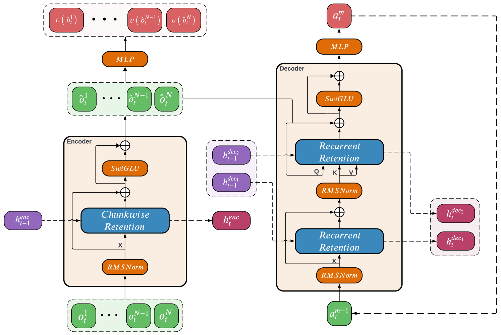

# Sable

Sable is an algorithm that was developed by the research team at InstaDeep. It also casts MARL as a sequence modelling problem and leverages the [advantage decompostion theorem](https://arxiv.org/pdf/2108.08612) through auto-regressive action selection for convergence guarantees and can scale to thousands of agents by leveraging the memory efficiency of Retentive Networks.

We provide two Anakin based implementations of Sable:
* [ff-sable](https://github.com/instadeepai/Mava/blob/develop/mava/systems/sable/anakin/ff_sable.py)
* [rec-sable](https://github.com/instadeepai/Mava/blob/develop/mava/systems/sable/anakin/rec_sable.py)

Here `ff` implies that the algorithm retains no memory over time but treats only the agents as the sequence dimension while `rec` implies that the algorithms maintains a memory over both agents and time for long context memory in partially observable environments.

For an overview of how the algorithm works, please see the diagram below. For a more detailed overview please see the associated [paper](https://arxiv.org/pdf/2410.01706).

    
    
 
 <em>Sable architecture and execution.</em> The encoder receives all agent observations 
<math>
  <msubsup>
    <mi>o</mi>
    <mi>t</mi>
    <mn>1</mn>
  </msubsup>
</math>, 
<math>
  <mo>&#x2026;</mo>
</math>, 
<math>
  <msubsup>
    <mi>o</mi>
    <mi>t</mi>
    <mi>N</mi>
  </msubsup>
</math>
from the current timestep <em>t</em> along with a hidden state 
<math>
  <msubsup>
    <mi>h</mi>
    <mrow>
      <mi>t</mi>
      <mo>-</mo>
      <mn>1</mn>
    </mrow>
    <mi>enc</mi>
  </msubsup>
</math>
representing past timesteps and produces encoded observations 
<math display="inline">
  <msubsup>
    <mrow>
      <mover accent="true">
        <mi>o</mi>
        <mo>^</mo>
      </mover>
    </mrow>
    <mi>t</mi>
    <mn>1</mn>
  </msubsup>
</math>
<math>
  <mo>&#x2026;</mo>
</math>, 
<math display="inline">
  <msubsup>
    <mrow>
      <mover accent="true">
        <mi>o</mi>
        <mo>^</mo>
      </mover>
    </mrow>
    <mi>t</mi>
    <mn>N</mn>
  </msubsup>
</math>,
observation-values 
<math>
  <mi>v</mi>
  <mo>(</mo>
  <msubsup>
    <mover>
      <mi>o</mi>
      <mo>^</mo>
    </mover>
    <mi>t</mi>
    <mn>1</mn>
  </msubsup>
  <mo>)</mo>
</math> 
<math>
  <mo>&#x2026;</mo>
</math>, 
<math>
  <mi>v</mi>
  <mo>(</mo>
  <msubsup>
    <mover>
      <mi>o</mi>
      <mo>^</mo>
    </mover>
    <mi>t</mi>
    <mi>N</mi>
  </msubsup>
  <mo>)</mo>
</math>
and a new hidden state 
<math>
  <msub>
    <mi>h</mi>
    <mi>t</mi>
  </msub>
  <msup>
    <mi>enc</mi>
  </msup>
</math>.

The decoder performs recurrent retention over the current action 
<math>
  <msubsup>
    <mi>a</mi>
    <mi>t</mi>
    <mrow>
      <mi>m</mi>
      <mo>-</mo>
      <mn>1</mn>
    </mrow>
  </msubsup>
</math>, followed by cross attention with the encoded observations, producing the next action 
<math>
  <msubsup>
    <mi>a</mi>
    <mi>t</mi>
    <mi>m</mi>
  </msubsup>
</math>. The initial hidden states for recurrence over agents in the decoder at the current timestep are 
<math>
  <mo>(</mo>
  <msubsup>
    <mi>h</mi>
    <mrow>
      <mi>t</mi>
      <mo>-</mo>
      <mn>1</mn>
    </mrow>
    <msub>
      <mi>dec</mi>
      <mn>1</mn>
    </msub>
  </msubsup>,
  <msubsup>
    <mi>h</mi>
    <mrow>
      <mi>t</mi>
      <mo>-</mo>
      <mn>1</mn>
    </mrow>
    <msub>
      <mi>dec</mi>
      <mn>2</mn>
    </msub>
  </msubsup>
  <mo>)</mo>
</math> and by the end of the decoding process, it generates the updated hidden states 
<math>
  <mo>(</mo>
  <msubsup>
    <mi>h</mi>
    <mi>t</mi>
    <msub>
      <mi>dec</mi>
      <mn>1</mn>
    </msub>
  </msubsup>,
  <msubsup>
    <mi>h</mi>
    <mi>t</mi>
    <msub>
      <mi>dec</mi>
      <mn>2</mn>
    </msub>
  </msubsup>
  <mo>)</mo>
</math>.

## Relevant paper:
* [Performant, Memory Efficient and Scalable Multi-Agent Reinforcement Learning](https://arxiv.org/pdf/2410.01706)
* [Retentive Network: A Successor to Transformer for Large Language Models](https://arxiv.org/pdf/2307.08621)