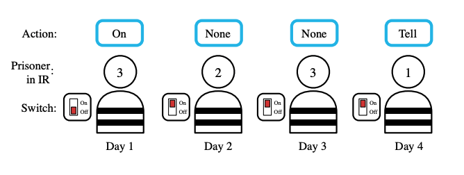

# Differentiable inter-agent learning (DIAL)

A common component of MARL systems is agent communication. Mava supports general purpose components specifically for implementing systems with communication. This system is an example of an implementation of differentiable inter-agent learning (DIAL) based on the work by [Foerster et al. (2016)][Foerster et al., 2016]. The trainer is implemented to work specifically for the switch game environment shown below.

[Foerster et al., 2016]: https://arxiv.org/abs/1605.06676
