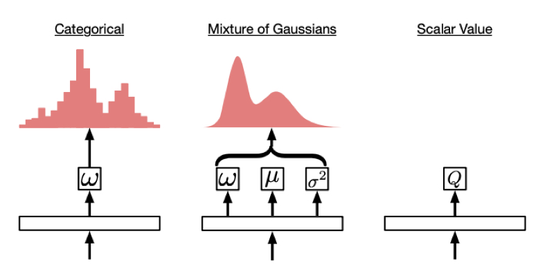

# Multi-Agent Distributed Distributional Deep Deterministic Policy Gradient (MAD4PG)

This system is an extension of the Distributed Distributional Deep Deterministic Policy Gradient (D4PG) algorithm ([Barth-Maron et al., 2018]) to the multi-agent setting.

[Barth-Maron et al., 2018]: https://arxiv.org/abs/1804.08617
