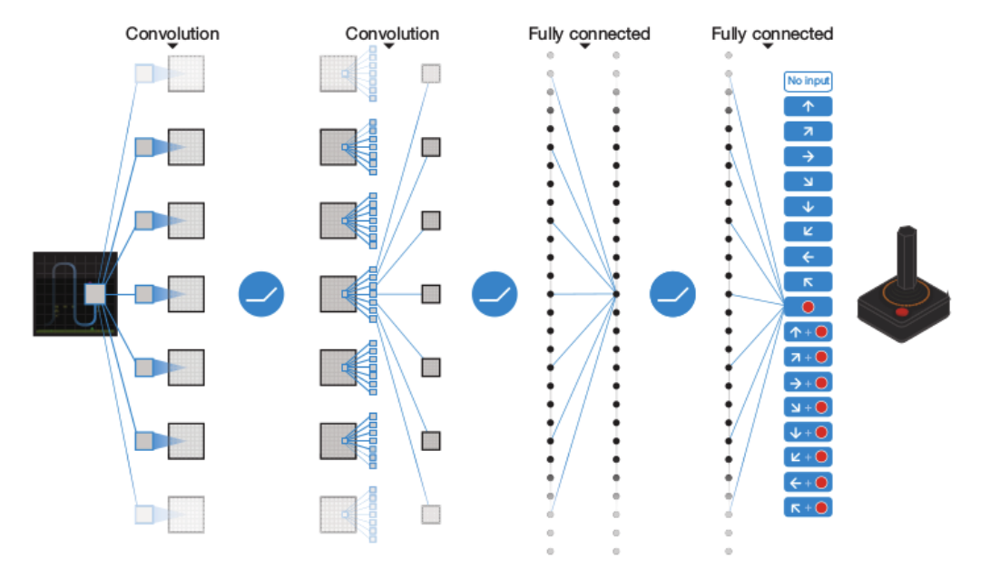

# Multi-Agent Deep Q-Networks (MADQN)

This system is an extension of Deep Q-Networks (DQN) ([Minh et al., 2013]) to the multi-agent setting. The first explored use of DQN in a multi-agent setting was by [Tampuu et al. (2017)]. Our current implementation is able to support fingerprint stabilisation ([Foerster et al., 2017])  and communication ([Foerster et al. 2016]).

[Minh et al., 2013]: https://arxiv.org/abs/1312.5602
[Tampuu et al. (2017)]: https://arxiv.org/pdf/1511.08779
[Foerster et al., 2017]: https://arxiv.org/abs/1702.08887
[Foerster et al. 2016]: https://arxiv.org/abs/1605.06676
