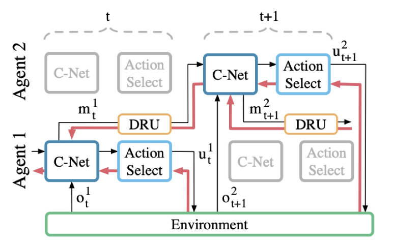

# Multi-Agent Proximal Policy Optimization (MAPPO)

A common component of MARL systems is agent communication. Mava supports general purpose components specifically for implementing systems with communication. This system is an example of an implementation of differentiable inter-agent learning (DIAL) based on the work by [Foerster et al. (2016)][Foerster et al., 2016].

[Yu et al., 2021]: https://arxiv.org/pdf/2103.01955